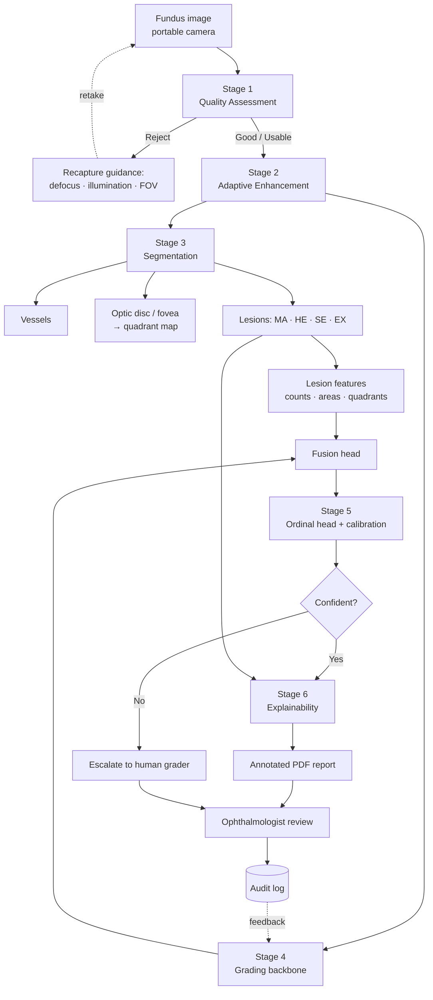
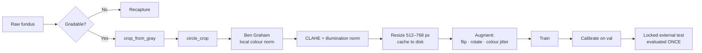

<div align="center">

# Diabetic Retinopathy Detection

### Explainable, quality-aware AI for diabetic retinopathy screening in rural India — built to be audited, not just admired

[](docs/04_ROADMAP.md)
[-blue)](LICENSE)
[](#getting-started)
[](#tech-stack)
[](#ethical-boundary--intended-use)

[**Analysis**](docs/01_PROJECT_ANALYSIS.md) · [**Literature**](docs/02_LITERATURE_REVIEW.md) · [**Tech Stack**](docs/03_TECH_STACK.md) · [**Roadmap**](docs/04_ROADMAP.md) · [**Prototype Scope**](docs/05_PROTOTYPE_SCOPE.md) · [**Report Bug**](https://github.com/adarshcod30/Diabetic-Retinopathy-Detection/issues)

</div>

> **⚠️ Development status.** This repository is in **Phase 0** of a 20-week plan. The architecture,
> evidence base, and validation protocol are complete and documented; models are not yet trained.
> Every performance figure below is labelled **target** until it is measured on a locked test set.
> No unmeasured number is presented as a result.

---

## Table of Contents

- [Overview](#overview)
- [Key Features](#key-features)
- [Tech Stack](#tech-stack)
- [System Architecture](#system-architecture)
- [Application Flow](#application-flow)
- [Data & ML Pipeline](#data--ml-pipeline)
- [Results & Model Performance](#results--model-performance)
- [Deployment & Infrastructure](#deployment--infrastructure)
- [Prototype Scope](#prototype-scope-tier-p)
- [Phase 1 Results](docs/06_PHASE1_RESULTS.md)
- [Project Structure](#project-structure)
- [Getting Started](#getting-started)
- [Usage](#usage)
- [Testing](#testing)
- [Roadmap](#roadmap)
- [Ethical Boundary & Intended Use](#ethical-boundary--intended-use)
- [Contributing](#contributing)
- [License](#license)
- [Contact](#contact)

---

## Overview

**Problem.** India has roughly **101 million adults with diabetes** (ICMR-INDIAB, *Lancet Diabetes &
Endocrinology* 2023 — 11.4 % weighted prevalence across 113,043 participants). Diabetic retinopathy
affects **14–17 %** of them, and there is approximately **one retina specialist per 1.26 million
people**. Manual screening at that scale is arithmetically impossible.

**Solution.** A seven-stage screening pipeline that assesses image quality before it grades, grades
using the International Clinical DR Severity Scale, and explains itself with lesion-level evidence a
clinician can verify in seconds — plus a discrete-event simulation of the district screening programme
the model would run inside.

**Why it is different.** Automated DR grading is a solved-enough problem: [Gulshan 2016](https://jamanetwork.com/journals/jama/fullarticle/2588763)
reached 97.5 % sensitivity, and [IDx-DR](https://www.nature.com/articles/s41746-018-0040-6) is
FDA-authorised. The unsolved problems are the ones this project targets:

1. **Explainability that is measured, not asserted.** Nearly every DR project ships a Grad-CAM and
   stops. This one runs [Adebayo's sanity checks](https://arxiv.org/abs/1810.03292) on the saliency
   method itself, then *quantifies* whether the heatmap lands on real lesions using IDRiD's
   pixel-level masks (pointing game, CAM–lesion IoU).
2. **Graceful failure on field images.** [Beede et al. (CHI 2020)](https://dl.acm.org/doi/10.1145/3313831.3376718)
   found that in 11 Thai clinics the dominant failure was ungradable images being silently rejected,
   wasting patient trips. Here, rejection returns an actionable reason: defocus, illumination, or
   field of view.
3. **Clinically grounded evidence.** Lesion segmentation feeds *both* the grade and the explanation,
   mapped onto the ICDR criteria — so the rationale is the same evidence the model actually used.

**Keywords:** `diabetic-retinopathy` `medical-imaging` `explainable-ai` `grad-cam` `deep-learning`
`pytorch` `image-segmentation` `fundus-photography` `computer-vision` `healthcare-ai` `ordinal-regression`
`model-calibration` `simpy` `rural-health` `screening`

---

## Key Features

| Feature | Description |
|---|---|
| **Quality gate with recapture guidance** | 3-class gradability model (EyeQ) fused with focus, illumination and FOV features; a rejected image returns *why*, so the operator can retake it while the patient is still seated |
| **Adaptive enhancement** | Ben Graham local-colour normalisation, CLAHE, illumination correction — every step ablated, none assumed |
| **Retinal structure segmentation** | Vessels (DRIVE), optic disc & fovea landmarks, and four lesion classes (MA, haemorrhage, hard/soft exudate) at pixel level |
| **Sub-pixel microaneurysm detection** | Candidate generation via morphological top-hat + matched filtering, then CNN classification — because MAs vanish under naïve downscaling |
| **Ordinal DR grading** | ICDR 0–4 with rank-consistent ordinal heads, not plain cross-entropy: grading 0 as 4 is not the same mistake as 0 as 1 |
| **Lesion-aware fusion** | CNN embedding concatenated with clinically meaningful lesion features (counts, areas, quadrant distribution) |
| **Calibrated confidence** | Temperature scaling with reliability diagrams and ECE; low-confidence cases escalate to a human grader |
| **Audited explainability** | Grad-CAM variants scored against ground-truth lesion masks, with sanity checks reported pass/fail |
| **Auto-generated clinical report** | Annotated PDF with lesion overlays, ICDR evidence table, and calibrated confidence — designed for a 30-second review |
| **Screening-programme simulation** | SimPy discrete-event model of a 100,000-patient/year district programme: bandwidth, throughput, grader capacity, ophthalmologist-hours freed |

---

## Tech Stack

| Layer | Technology |
|---|---|
| DL framework | PyTorch 2.x · PyTorch Lightning · timm |
| Medical imaging | MONAI · segmentation-models-pytorch |
| Classical CV | OpenCV · scikit-image · Albumentations |
| Explainability | pytorch-grad-cam (Grad-CAM / ++ / Score-CAM / Eigen-CAM) |
| Config & tracking | Hydra + OmegaConf · Weights & Biases |
| Metrics & statistics | torchmetrics · scikit-learn · scipy · statsmodels (bootstrap CI, DeLong, McNemar) |
| Simulation | SimPy *(optional Simulink mirror)* |
| Serving | FastAPI · ONNX Runtime · Docker |
| Demo | Gradio → HuggingFace Spaces |
| Reporting | ReportLab |
| Quality | ruff · pytest · pre-commit · GitHub Actions |

Rationale for every choice, including the MATLAB→open-source mapping: [`docs/03_TECH_STACK.md`](docs/03_TECH_STACK.md).

---

## System Architecture



**In plain language.** An image arrives from a portable camera in a primary health centre. Before
anything else, the system decides whether it is *gradable* — and if not, tells the operator exactly
what to fix. A gradable image is normalised for the wide variation in camera and lighting, then passed
down two parallel paths: one segments the retina's structures and lesions, the other classifies overall
severity. The two paths meet at a fusion head, because the lesions a clinician would look for are
exactly the features that should drive the grade. The result is calibrated into an honest probability;
uncertain cases go straight to a human. Confident cases produce a report whose explanation is grounded
in the same lesion evidence the model used — not a decorative heatmap. Every decision is logged, and
graders' corrections feed the next training round.

---

## Application Flow

```mermaid
sequenceDiagram
    participant P as Patient
    participant H as Health worker
    participant E as Edge app
    participant S as District server
    participant O as Ophthalmologist

    P->>H: Arrives at screening camp
    H->>E: Capture fundus image
    E->>E: On-device quality check
    alt Ungradable
        E-->>H: "Image defocused — retake"
        H->>E: Recapture
    end
    E->>S: Upload (store-and-forward if offline)
    S->>S: Enhance → segment → grade → calibrate
    alt High confidence, no DR
        S-->>H: Auto-cleared · routine recall
    else Referable or uncertain
        S->>O: Queue annotated report
        O->>O: Review (~30 s target)
        O-->>H: Confirmed grade + referral
    end
    H-->>P: Result and next step
    O->>S: Correction logged for retraining
```



The **on-device quality check is deliberate**: a round trip to the cloud to learn the image was blurry
is precisely the failure mode documented in Thailand. The check must complete while the patient is
still in the chair.

---

## Data & ML Pipeline

### Data sources

| Dataset | Size | Labels | Population | Role | Licence |
|---|---|---|---|---|---|
| [APTOS 2019](https://www.kaggle.com/c/aptos2019-blindness-detection) | 3,662 | ICDR 0–4 | **India** (Aravind, Madurai) | Primary training | Competition rules |
| [EyePACS 2015](https://www.kaggle.com/c/diabetic-retinopathy-detection) | 88,702 | ICDR 0–4 (noisy) | US | Pretraining *(cloud-side only)* | Competition rules |
| [IDRiD](https://ieee-dataport.org/open-access/indian-diabetic-retinopathy-image-dataset-idrid) | 516 | Grades + **pixel masks** + OD/fovea | **India** (Nanded) | Lesion segmentation, XAI ground truth | CC BY 4.0 |
| [Messidor-2](https://www.adcis.net/en/third-party/messidor2/) | 1,748 | Adjudicated grades | France | **Locked external test** | ADCIS terms |
| [DRIVE](https://drive.grand-challenge.org/) | 40 | Vessel masks | Netherlands | Vessel segmentation | Research use |
| EyeQ | 28,792 | Good / Usable / Reject | derived from EyePACS | Quality model | Research use |

> Raw images are **never committed**. `scripts/download_data.sh` fetches them; `data/manifests/` commits
> sha256 hashes so anyone can verify byte-identical inputs.

### Pipeline



**Cleaning & preparation.** Circle-crop removes the black surround and standardises the field of view;
`crop_from_gray` handles off-centre captures. **Ben Graham preprocessing** — subtracting a heavily
blurred copy to remove local average colour — is the single highest-value step, as established by the
Kaggle DR 2015 winner and used by most APTOS top solutions. Preprocessed images are cached once at
512 px, which shrinks APTOS from ~10 GB to ~200 MB and makes every subsequent epoch cheaper.

**Feature engineering.** Beyond learned features, the lesion branch yields *clinically named* features:
microaneurysm count, haemorrhage and exudate area, per-quadrant distribution (using the optic
disc–fovea axis), and distance-to-fovea. These are the ICDR criteria expressed numerically — they
improve the grade and simultaneously become the explanation.

**Training approach.**
- Two-stage: pretrain on EyePACS (or initialise from [RETFound](https://www.nature.com/articles/s41586-023-06555-x),
  a masked-autoencoder foundation model trained on 1.6 M retinal images), then fine-tune on APTOS.
- **Ordinal loss**, not cross-entropy — DR grades are ordered, and recent SOTA
  ([Dual-SwinOrd](https://www.mdpi.com/2306-5354/13/4/374), AOR-DR) confirms this matters.
- **Resolution is the dominant hyperparameter.** A microaneurysm is ~10 px on a 4288 px image; at
  224 px it is sub-pixel and physically destroyed. Sweep 384/512/768 early.
- **Patient-level splits** — both eyes of one patient must never straddle train and test.

**Evaluation metrics.** Quadratic Weighted Kappa (grading); sensitivity and specificity at the
referable-DR operating point (grade ≥ 2); AUROC; **AUPRC for lesion segmentation** (lesion pixels are
<0.1 % of an image, which makes AUROC flattering and near-meaningless); Expected Calibration Error;
all with bootstrap 95 % CIs, DeLong for AUC comparisons, and McNemar for paired sensitivity/specificity.

---

## Results & Model Performance

### Phase 1 baseline — measured

EfficientNet-B0 · 512 px · APTOS fold 0 · 733 validation images ([full report](docs/06_PHASE1_RESULTS.md))

| Metric | Value | 95% CI |
|---|---|---|
| QWK (5-class) | **0.8930** | [0.8673, 0.9155] |
| Referable sensitivity | **0.919** | [0.887, 0.949] |
| Referable specificity | **0.940** | [0.917, 0.962] |
| ECE (uncalibrated) | 0.0646 | — |

> **Internal validation, not a headline result.** The operating threshold was chosen on the same
> split it is scored on, and that split also drove model selection — so these are optimistic. The
> honest number comes from the locked Messidor-2 test set in Phase 8, where a ~10-point drop is
> normal. Per-class recall is weak for grade 1 (0.54) and grade 3 (0.36); the errors are mostly
> *safe* over-calls that stay inside the referral boundary, which is why referable sensitivity holds
> up. Full analysis, confusion matrix and what Phase 3 must fix: [`docs/06_PHASE1_RESULTS.md`](docs/06_PHASE1_RESULTS.md).

### Phase 3 ablation — thirteen configurations, three significant negatives, one significant positive whose cause is now in question

| # | Configuration | QWK | vs baseline |
|---|---|---|---|
| 1 | **Baseline** 512 px, cross-entropy | **0.8930** | — |
| 2 | 384 px | 0.8845 | p = 0.490 |
| 3 | CORN ordinal loss | 0.8951 | p = 0.851 |
| 4 | CORN + task balancing | 0.8950 | p = 0.734 |
| 5 | CORN + macro-recall selection | 0.8790 | p = 0.749 |
| 6 | 768 px | 0.8986 | p = 0.603 |
| 7 | Warmup 8 (control) | 0.8958 | p = 0.910 |
| 8 | Warmup 8 + grad. accumulation ×4 | 0.8942 | p = 0.860 vs control |
| 9 | `--monitor val/sens_at_spec85`, floor 0.85 | 0.8557 | **p = 0.003, significant — worse** |
| 10 | `--spec-floor 0.92` (recalibrated) | 0.8802 | p = 0.272, n.s. |
| 11 | **1024 px** (Kaggle T4) | **0.9122** | p = 0.104, n.s. on QWK — **exact-grade accuracy p = 0.0003, significant** |
| 12 | ConvNeXt-Tiny backbone (zero BatchNorm) | 0.8870 | p = 0.630, n.s. on QWK — **exact-grade accuracy p = 0.019, significant — worse** |
| 13 | **1024 px, local (MPS, same backend as baseline)** | 0.8813 | p = 0.374, n.s. vs baseline — but **p = 0.001, significant vs the Kaggle 1024px run itself** |

Paired tests (McNemar on discordant pairs, paired bootstrap for QWK) on the same 733-image
validation split. **The baseline stands on QWK at α = 0.05. 1024 px on Kaggle is still numerically
the highest QWK in the table — but Result 14 below found that switching only the compute backend,
nothing else, moves this exact metric by a similar margin, which means that number can no longer be
credited to resolution with any confidence.**

> **1024 px, same backend (Result 14): the confound was measured, and it's real.** Result 12's
> Kaggle run was confounded with a backend change (CUDA/T4 vs this project's usual MPS) that it
> called "usually negligible... not something measured." Running the identical 1024 px config
> locally settles it: against the local baseline it's null (QWK -0.0117, p = 0.374) — the same
> conclusion as every other resolution tried. But against the Kaggle 1024px run itself, with
> nothing but the backend different, QWK drops by 0.031 (p = 0.001) and exact-grade accuracy
> differs significantly too (p = 0.027) — a bigger, now-measured effect than the resolution change
> Result 12 reported in the first place. This doesn't mean Result 12 was wrong, but it does mean
> its causal story ("1024 px resolves microaneurysms, therefore accuracy improves") no longer holds
> over the simpler explanation that backend differences alone can move this metric by a comparable
> amount. Full writeup: [`docs/07_PHASE3_RESULTS.md`](docs/07_PHASE3_RESULTS.md), Result 14.

> **ConvNeXt-Tiny (Result 13): a named hypothesis, tested and refuted.** An earlier benchmarking
> pass flagged EfficientNet-B0's BatchNorm at batch 4 as a plausible cause of the majority-class
> collapse, since its running statistics are noisy per micro-batch. ConvNeXt-Tiny uses LayerNorm
> throughout — confirmed to have zero BatchNorm layers before spending any training time on it —
> which has no batch-size dependence at all. The exact same collapse happened anyway: grade-1
> recall fell from 0.541 to 0.230, with 51 of 74 true grade-1 images predicted grade 2 — the same
> failure mode as CORN's collapse (Result 2, 49 of 74), on a completely different architecture.
> This closes the BatchNorm hypothesis; `val/qwk` selection rewarding grade-2-confident epochs
> (Result 3) remains the one mechanism consistent across every collapse observed so far. Full
> writeup: [`docs/07_PHASE3_RESULTS.md`](docs/07_PHASE3_RESULTS.md), Result 13.

> **Two hypotheses tested and refuted, plus a fix that backfired.** §2.2 of the analysis argued
> resolution was the dominant hyperparameter, because grade 1 is defined by microaneurysms
> (~1.2 px at 512). Across 384/512/768 px, grade-1 recall fell *monotonically* — 0.622 → 0.541 →
> 0.419 — rather than rising (Result 5). A follow-up hypothesis — that a sharp training-time
> collapse into grade 2 was an optimisation artifact fixable by warmup or accumulation — was also
> refuted: a warmup control showed the collapse is not LR-locked (Result 6), and accumulation ×4
> eliminated it entirely yet left QWK unmoved, because the real cause was checkpoint selection on
> QWK favouring grade-2-heavy epochs regardless of the loss curve's shape (Result 8). Fixing that
> selection problem directly — `--monitor val/sens_at_spec85`, maximizing sensitivity subject to
> this project's own 85% specificity target — correctly avoided the collapse epoch, then failed
> differently: the floor saturates on this task (16 epochs compress into a 0.013 QWK-uncorrelated
> band), so `ModelCheckpoint` chose an epoch significantly worse than the baseline (p = 0.003) and
> worse than another epoch in its own run (Result 9). A same-seed variance check found every other
> effect size in this table sits inside normal run-to-run noise (Result 7). Recalibrating the floor
> to 0.92 (Result 11) fixed exactly the saturation just described — the metric's discriminating span
> widened roughly 5x — and QWK returned to null (p = 0.272) rather than becoming an improvement,
> closing the selection-metric branch of this investigation. Full analysis and all ten
> configurations: [`docs/07_PHASE3_RESULTS.md`](docs/07_PHASE3_RESULTS.md).

> **5-fold cross-validation (Result 10):** every number above came from one held-out fold. Running
> the baseline across all 5 folds gives **QWK 0.8965 ± 0.0116** (0.8967 / 0.9090 / 0.8955 / 0.8756 /
> 0.9056) — the single-fold baseline was representative, not a lucky split, which validates every
> comparison above. It also shows QWK ≥ 0.90 is a **~40% background rate** at this sample size (2 of
> 5 folds clear it), and that grade-3 recall is consistently poor across every fold rather than an
> artifact of one split. EyePACS pretraining and RETFound init were investigated as the next lever
> and found not runnable locally right now (RETFound ships only a ~300M-parameter ViT behind a gated
> download; EyePACS needs Kaggle-scale compute) — see `docs/07_PHASE3_RESULTS.md`.

> **1024 px (Result 12):** the resolution this project's own memory ceiling had ruled out locally,
> run on Kaggle's T4 instead. Highest QWK of the whole phase (0.9122), but the paired test against
> baseline lands at p = 0.104 — not significant by the same α = 0.05 bar every other row was judged
> on. What *is* significant: exact ICDR grade accuracy, McNemar p = 0.0003 (60 images right that the
> baseline missed vs. 26 the other way) — a real signal the ordinal-weighted QWK metric dilutes.
> Two honest caveats keep this a lead rather than a closed case: it ran on a different compute
> backend (CUDA/T4, not this project's usual MPS) than every other row, and it is a single fold like
> everything else in this table. Full numbers and both caveats: `docs/07_PHASE3_RESULTS.md`.

### Phase 4 segmentation — 5-fold CV: hard-exudate test AUPRC 0.850 ± 0.029

| Fold | Internal val AUPRC | Test AUPRC (27 img, held out) | Dice @ 0.5 | Dice @ tuned threshold |
|---|---|---|---|---|
| 0 | 0.8893 | 0.8584 | 0.7440 | 0.7864 |
| 1 | 0.9138 | 0.8543 | 0.7465 | 0.7773 |
| 2 | 0.9017 | 0.7941 | 0.5540 | 0.7523 |
| 3 | 0.8972 | 0.8796 | 0.7762 | 0.7917 |
| 4 | 0.8929 | 0.8633 | 0.7339 | 0.7917 |
| **mean ± std** | **0.8990 ± 0.0085** | **0.8500 ± 0.0292** | 0.7109 ± 0.0797 | **0.7799 ± 0.0148** |

The roadmap's own plan for Phase 4 lesions is "hard exudates first — establishes the harness"
before the other lesion types, with 5-fold CV specified for this exact task given how few images
IDRiD's segmentation split has (81 total). A DeepLabV3+/resnet34 model with a combined BCE+Dice
loss, BCE `pos_weight` (~15-19 across folds) measured empirically from actually-sampled training
patches rather than derived from the ~1,400:1 whole-image imbalance ratio, trained on each of 5
`KFold` splits of IDRiD's 54 training images and scored, every time, on the same fixed 27 official
test images via tiled full-resolution inference. Dice is reported both at a fixed 0.5 and at a
threshold tuned per fold on that fold's own validation split (then frozen before touching test) —
the fixed threshold's fold-to-fold spread (std 0.080) is over 5x the tuned threshold's (std 0.015)
on the identical checkpoints, driven mostly by fold 2's early-stopped, less-mature model. Full
method and both mechanism-level findings: [`docs/10_PHASE4_RESULTS.md`](docs/10_PHASE4_RESULTS.md).

### Phase 4 vessels — AUROC close to target (0.9416 ± 0.0035), Dice is not (0.662 ± 0.023)

| Fold | AUROC | Dice @ 0.5 | Dice @ best-possible (same-data, not a held-out tune) |
|---|---|---|---|
| 0 | 0.9451 | 0.6641 | 0.7051 |
| 1 | 0.9421 | 0.6980 | 0.7185 |
| 2 | 0.9354 | 0.6241 | 0.6676 |
| 3 | 0.9407 | 0.6628 | 0.6931 |
| 4 | 0.9448 | 0.6614 | 0.7038 |
| **mean ± std** | **0.9416 ± 0.0035** | 0.6621 ± 0.0234 | 0.6976 ± 0.0170 |

DRIVE's official test split ships no vessel ground truth at all (confirmed directly — only
`images/` and a field-of-view mask), so all 20 publicly-labelled images went into 5-fold CV instead
of a train/locked-test split. A DeepLabV3+/resnet34 model, trained on full (not patched) images
since DRIVE is small enough, with both loss and every metric computed only inside each image's own
field-of-view mask — otherwise a model that trivially gets the black surround right looks better
than it is. AUROC is both strong and remarkably stable (tighter than any other 5-fold CV run in
this project) and close to the roadmap's 0.97+ target; Dice sits 0.14 below the 0.80+ target, and
checking directly (sweeping every threshold on each fold's own validation images) shows only ~3.5
points of that gap is a fixed-threshold artifact — most of it looks like a genuine capacity/data-scale
shortfall on fine, thin vessel-branch boundaries specifically, where Dice penalises small pixel
misalignments far more than AUROC's ranking-based formulation does. Full method and the diagnostic
that ruled out the threshold explanation: [`docs/11_PHASE4_VESSELS_RESULTS.md`](docs/11_PHASE4_VESSELS_RESULTS.md).

### Phase 4 OD/fovea localisation — target cleared: 0.075 mean error vs. a 0.5 target

| | OD error (mean) | Fovea error (mean) | Combined mean | Images clearing target |
|---|---|---|---|---|
| Internal val (62 img) | — | — | 0.0587 | — |
| **Official test (103 img, held out)** | **0.0463** | **0.1029** | **0.0746** | 103/103 OD · 100/103 fovea |

The first Phase 4 sub-item with an unambiguous numeric target that clears it outright, by roughly
6.7x. Heatmap regression (DeepLabV3+/resnet34, 2-channel output, one Gaussian-target channel each
for optic disc and fovea) on IDRiD's official 413-train/103-test localisation split — the largest,
cleanest-labelled IDRiD subset used in this project (516 images vs. hard exudates' 81). Since
per-image OD diameter isn't available for this task (only the disjoint 81-image segmentation subset
ships OD masks, under different filename numbering that can't be joined to this one), the roadmap's
"0.5x OD diameter" unit uses the mean diameter measured directly from those 54 real masks (527.7px
at full resolution) as a fixed proxy. OD localisation is reliable on every single test image; the
three fovea failures (worst: IDRiD_065 at 1.665 diameters) all keep excellent OD accuracy alongside
them, pointing at a fovea-specific weakness — plausibly its low, boundary-less contrast next to the
optic disc's sharp edge — rather than a general localisation problem.

**Quadrant mapping** (the next roadmap item) needed no model at all: two lines through the OD, one
along the OD-fovea axis and one perpendicular, verified by 6 unit tests plus a direct check against
a real trained prediction. Labels describe geometry ("foveal-side"/"disc-side",
"superior"/"inferior"), not asserted nasal/temporal anatomy, since eye laterality isn't reliably
available in this project's datasets to make that mapping safely. Full method, the fovea-outlier
analysis, and the quadrant-mapping scope note:
[`docs/12_PHASE4_LOCALIZATION_RESULTS.md`](docs/12_PHASE4_LOCALIZATION_RESULTS.md).

### Phase 4 haemorrhages — validation looks fine (0.767 ± 0.033), the test set disagrees (0.540 ± 0.041)

| Fold | Val AUPRC | Test AUPRC | Dice @ 0.5 | Dice @ tuned |
|---|---|---|---|---|
| 0 | 0.8112 | 0.5514 | 0.3968 | 0.5380 |
| 1 | 0.7644 | 0.5375 | 0.4979 | 0.5416 |
| 2 | 0.7334 | 0.5844 | 0.4957 | 0.5603 |
| 3 | 0.7981 | 0.5628 | 0.4935 | 0.5340 |
| 4 | 0.7295 | 0.4649 | 0.4088 | 0.4869 |
| **mean ± std** | **0.7673 ± 0.0330** | **0.5402 ± 0.0407** | 0.4585 ± 0.0457 | 0.5322 ± 0.0244 |

The identical hard-exudate harness, unchanged, retargeted at haemorrhages via `--lesion`. The
val→test drop here (0.767→0.540) is far larger than hard exudates showed on the same code
(0.899→0.850) — every fold drops by a similar amount, not one bad fold skewing the mean. A
plausible but unconfirmed mechanism: haemorrhages vary more in size and shape (small dot vs. larger
blot haemorrhages) than hard exudates' more visually consistent appearance, so 43 training images
per fold may cover the real variation less completely. Threshold tuning still helps here too (Dice
std 0.046→0.024) but can't close a gap this size. This run also survived a real infrastructure
hiccup — a session-boundary SIGTERM interrupted fold 4 mid-training, and it was resumed cleanly from
its own checkpoint rather than retrained from scratch, landing at the identical best epoch it had
already reached live. Full method and the incident notes:
[`docs/13_PHASE4_HAEMORRHAGES_RESULTS.md`](docs/13_PHASE4_HAEMORRHAGES_RESULTS.md).

### Phase 4 soft exudates — test AUPRC 0.614, val 0.812 (single split, smallest lesion subset)

| Split | AUPRC | Dice @ 0.5 | Dice @ tuned (0.775) |
|---|---|---|---|
| Val (6 img) | 0.8117 | — | 0.5755 |
| Test (14 img, held out) | 0.6144 | 0.5546 | 0.5929 |

Same harness again, retargeted via `--lesion soft_exudates`. Per an explicit scoping decision made
partway through Phase 4 (to manage total time across the remaining Phase 4/5/6 items), this is a
**single train/val split, not 5-fold CV** — one data point, not a distribution. Soft exudates is
IDRiD's smallest segmentation subset (26 training images total, half of haemorrhages'), and the
val→test AUPRC drop (0.812→0.614) lands between hard exudates' (0.899→0.850) and haemorrhages'
(0.767→0.540) — roughly the outcome the roadmap anticipated going in ("fewest training examples,
weakest signal"), though the size-vs-morphology question of why the gap isn't *larger* than
haemorrhages' despite less data remains unverified. Threshold tuning helps again (Dice 0.5546→0.5929).
Full method: [`docs/14_PHASE4_SOFT_EXUDATES_RESULTS.md`](docs/14_PHASE4_SOFT_EXUDATES_RESULTS.md).

### Phase 4 microaneurysms — strong candidate recall (96.8%), a classifier that doesn't generalise to it

| Stage | Val | Test (27 img, held out) |
|---|---|---|
| Generation-stage recall (ceiling) | 0.9168 | 0.9677 |
| Candidate-level AUPRC | — | 0.2524 |
| End-to-end recall @ tuned threshold | — | 0.2808 |
| End-to-end precision @ tuned threshold | — | 0.3564 |

The last IDRiD lesion type, and the only one the roadmap says needs a different method: classical
top-hat candidate generation feeding a small (~24K-param) CNN classifier, not plain segmentation.
The generation stage clears a high bar — 96.8% of true microaneurysms on the test set get at least
one candidate proposed. The classifier stage is the real bottleneck: trained on a curated,
subsampled candidate pool (10-100x more negatives than positives per image), it doesn't generalise
to a real image's true imbalance (7,000-40,000 candidates against 10-130 true instances) — training
reported val/AUPRC 0.75, but scoring the same checkpoint against every real candidate an image
proposes gave test AUPRC 0.17. Retraining with a much higher negative ratio (100x) closed part of
that gap (test AUPRC 0.17→0.25) without closing all of it. Two real bugs were caught and fixed
during development: Otsu thresholding catastrophically failing on this response distribution
(measured 3/18 recall before the fix), and a whole-image-padding bug in patch extraction that drove
memory to a 39GB peak and aborted the process before being fixed to an 820MB peak (~48x reduction).
Full method, both bugs, and the honest classifier numbers:
[`docs/15_PHASE4_MICROANEURYSMS_RESULTS.md`](docs/15_PHASE4_MICROANEURYSMS_RESULTS.md).

### Phase 5 fusion head — an honest negative result: fusion doesn't beat grading alone (yet)

| | Grading-alone (baseline) | Fusion head |
|---|---|---|
| Val QWK (150 img) | 0.9556 | 0.9362 |
| Val accuracy | 0.9067 | 0.8933 |

McNemar on paired correctness: 6 images baseline got right that fusion missed, 4 the other way,
p=0.754 — not significant, and if anything the balance favours the baseline. Phase 4 made this
item possible for the first time: `concat(1280-d CNN embedding, 9 lesion features)` through a
small MLP trained with this project's existing rank-consistent ordinal loss (CORN). The lesion
features come from running Phase 4's IDRiD-trained models on 750 APTOS images (150/grade) — APTOS
has no lesion ground truth of its own, so every feature here is a genuine, checked-but-unproven
cross-dataset hypothesis (a cheap sanity check first: the hard-exudate model's predicted
probability rose with DR grade on APTOS despite never training on it). Plausible reasons fusion
didn't help: a small sample (only 10 discordant pairs to test on), noisy lesion features
(particularly the microaneurysm count — that classifier's own docs/15 result already shows it
under-generalises even on IDRiD), or redundancy with what the CNN embedding already captures.
None of these is confirmed; closing this gap is next. Full method and honest numbers:
[`docs/16_PHASE5_FUSION_RESULTS.md`](docs/16_PHASE5_FUSION_RESULTS.md).

### Phase 5 uncertainty + escalation — this one works: a 35-point accuracy gap between confidence quintiles

| Uncertainty quintile | Accuracy |
|---|---|
| Q1 (most confident) | 0.9932 |
| Q2 | 0.9932 |
| Q3 | 0.7755 |
| Q4 | 0.7192 |
| Q5 (least confident) | 0.6438 |

Spearman(uncertainty, correctness) = -0.382, p = 8.0e-27 — about as far from chance as a result in
this project gets. MC-dropout on the baseline checkpoint (20 stochastic passes/image, BatchNorm
re-frozen after reactivating dropout — EfficientNet's dropout in `timm` is functional, not a
removable module, so standard reactivation would also un-freeze BatchNorm's running stats without
this fix) produces an uncertainty signal that cleanly separates the model's reliable predictions
from its unreliable ones on its own standard 733-image validation fold. Escalating the most
uncertain 20% of cases to an assumed-perfect grader lifts QWK from 0.894 to 0.940; escalating 50%
reaches 0.991. That's a stated ceiling, not a measured human accuracy — this project has no real
reviewer to test the escalation policy against, same constraint as Phase 6's clinician timing
study. Full method and numbers:
[`docs/17_PHASE5_UNCERTAINTY_RESULTS.md`](docs/17_PHASE5_UNCERTAINTY_RESULTS.md).

### Phase 6 CAM localisation — attention never once finds a microaneurysm, but is 3.7×–53× above chance everywhere else

| Lesion type | Chance rate | Grad-CAM | Grad-CAM++ | Eigen-CAM |
|---|---|---|---|---|
| Microaneurysms | 0.104% | 0.0% (0.0×) | 0.0% (0.0×) | 0.0% (0.0×) |
| Haemorrhages | 1.025% | 3.75% (3.7×) | 3.75% (3.7×) | 3.75% (3.7×) |
| Hard exudates | 0.900% | 16.05% (17.8×) | 14.81% (16.5×) | 14.81% (16.5×) |
| Soft exudates | 0.378% | 20.00% (53.0×) | 20.00% (53.0×) | 20.00% (53.0×) |
| Optic disc | 1.781% | 25.93% (14.6×) | 28.40% (15.9×) | 32.10% (18.0×) |

Pointing-game accuracy (does the CAM's single peak land on the lesion) against all 81 IDRiD
segmentation-subset images, with a chance baseline computed from each lesion type's own mean mask
area — without it, a number like "3.75%" reads as failure, when haemorrhages only cover ~1% of
the image, making it 3.7× better than a random guess. Microaneurysms are the one lesion type CAM
attention never lands on, across all 81 images and all 3 methods tested — consistent with this
project's own Phase 3 finding that they're sub-resolution (~1-3px) at the sizes grading actually
trains at. Everything else scores well above chance. **A second, sharper finding**: Eigen-CAM
already *failed* the model-randomisation sanity check (it's provably blind to the classifier's
weights) — yet it posts the *highest* optic-disc score here (18.0× chance), because the optic disc
is generically salient in almost any fundus photo, independent of whether the model learned
anything. A pointing-game/IoU table alone would have rated Eigen-CAM the best of the three; only
running the sanity check first shows that's backwards. Full method and both findings:
[`docs/18_PHASE6_CAM_LOCALIZATION_RESULTS.md`](docs/18_PHASE6_CAM_LOCALIZATION_RESULTS.md).

### Phase 6 report redesign — lesion overlays, ICDR evidence, and a rationale grounded in real detections

The last three buildable Phase 6 items, verified end to end on a real image rather than just
unit-tested: outline renders (not filled blobs — an outline points at tissue without hiding it) for
hard/soft exudates and haemorrhages, circle markers for accepted microaneurysm candidates, and a
templated rationale reporting what was actually detected rather than restating the predicted grade.
On IDRiD_20 (predicted grade 3, Severe NPDR), the rationale read: *"147 microaneurysm candidate(s);
77 haemorrhage region(s) across 4 quadrant(s); hard exudates covering 2.09% of the image..."* —
haemorrhages in all 4 quadrants happens to be one of ICDR's own defining criteria for severe NPDR, an
unprompted alignment between the detected evidence and the predicted grade. A grade-4 rationale
states outright that proliferative DR's defining feature (neovascularisation) has no detector in
this project, rather than implying evidence that was never found. The extended PDF report (third
image panel, colour legend, evidence text) still fits comfortably on one A4 page. Full method:
[`docs/19_PHASE6_REPORT_RESULTS.md`](docs/19_PHASE6_REPORT_RESULTS.md).

### Phase 7 simulation — bandwidth doesn't matter, grader headcount is everything

A SimPy discrete-event model of the full screening flow (camps → capture → upload → inference →
triage → human review), parameterised from this project's own measured CPU inference throughput
(2,137 ms/image for grading; **+41.9 seconds/image** for full lesion-evidence extraction — the
Phase 6 two-tier design turns out to be close to mandatory, not a nicety) and real fundus-photo
file size (392.6 KB mean, correcting an earlier ~4 MB guess by ~10×). Grader throughput has no
single trustworthy published figure, so it is cited from three real sources and swept 10–30/hr
rather than trusted as one number. **Bandwidth (1/5/10 Mbps) changes nothing measurable** at
100,000 patients/year — confirming, not assuming, that human review capacity is the actual
bottleneck. At this project's base-case grader rate: **2 graders collapses the queue** (p90
turnaround ≈1,084 hours), **4 graders is marginal** (97–98% utilisation), **8 graders is
comfortable** (<50% utilisation, turnaround in minutes) — a district planning for 100k
patients/year should budget 6–8 dedicated graders. The auto-clear sensitivity sweep quantifies a
real tradeoff, not just a benefit: widening the confidence threshold to its most permissive
setting frees an extra ~2,236 grader-hours/year but more than doubles the wrong-auto-clear rate
(0.85%→1.90% of auto-cleared cases, i.e. ~489→1,733 patients/year with true grade >0 told "no
follow-up needed"). Full method and every scenario: [`docs/20_PHASE7_SIMULATION_RESULTS.md`](docs/20_PHASE7_SIMULATION_RESULTS.md).

### Phase 8 locked external validation — run once, and the drop was real

The result the whole project was built to produce, and the only evaluation ever run against
Messidor-2 and IDRiD's grading test split (1,847 images total). Two finalists went in — the
baseline and a regression-loss variant that internal validation couldn't cleanly decide between
(see the Phase 3 ablation section above) — precisely so this external look could be the
tie-breaker instead of another round of internal tuning. **It was**: referable-DR AUC 0.9242
(regression) vs. 0.8878 (baseline), DeLong p=6.1×10⁻¹⁰ — decisive, and in the opposite direction
from what the internal exact-grade comparison would have predicted. **Regression loss is the
model this project would release.**

The external drop itself is larger than this project's own pre-registered expectation: both
models land at 41–44% referable sensitivity externally, far under the ≥90% target and every
published comparator, even though specificity (97%+) and AUC (0.888–0.924, comparable to a cited
Gulshan-reproduction's 0.853 Messidor-2 AUC) held up much better. Checking the actual score
distributions — not just the pass/fail count — shows why: the median score among truly-referable
external images sits roughly an order of magnitude below the threshold frozen from APTOS internal
validation. That is a **calibration failure, not primarily a discrimination failure** — and the
threshold was not re-tuned after seeing this, since doing so would be exactly the "chose the
threshold on test" cheat this project's own analysis document warns against. A real deployment on
a new population needs its own calibration set, not this project's frozen cut-point. Full method,
every number, the failure-mode gallery (both models' worst errors independently misjudge the same
one image as severe disease), and the published-benchmark comparison table:
[`docs/22_PHASE8_VALIDATION_RESULTS.md`](docs/22_PHASE8_VALIDATION_RESULTS.md).

### Remaining targets

| Metric | Target | Benchmark it is measured against |
|---|---|---|
| Referable DR sensitivity | **≥ 90 %** | Ting 2017: 90.5 % · IDx-DR: 87.2 % · Google/Aravind: 88.9 % |
| Referable DR specificity | **≥ 85 %** | Ting 2017: 91.6 % · IDx-DR: 90.7 % · Google/Aravind: 92.2 % |
| QWK (APTOS, 5-class) | **≥ 0.90** | Dual-SwinOrd SOTA: 0.9370 |
| Quality classification (EyeQ) | **≈ 0.90 acc** | VISTA: 0.9066 acc, 0.8868 F1 |
| Lesion AUPRC (IDRiD) | per-class, cross-validated | IDRiD ISBI-2018 challenge leaderboard |
| Calibration (ECE) | **< 0.05** after temperature scaling | — |
| Grad-CAM localisation | pointing-game accuracy vs IDRiD masks | *rarely reported — this is the contribution* |

### Published comparators

| Study | Task | Sensitivity | Specificity | AUC |
|---|---|---|---|---|
| [Gulshan 2016 (JAMA)](https://jamanetwork.com/journals/jama/fullarticle/2588763) | Referable DR, EyePACS-1 | 97.5 % | 93.4 % | 0.991 |
| [Ting 2017 (JAMA)](https://pubmed.ncbi.nlm.nih.gov/29234807/) | Referable DR, multiethnic | 90.5 % | 91.6 % | 0.936 |
| [Abràmoff 2018 (npj Digit Med)](https://www.nature.com/articles/s41746-018-0040-6) | mtmDR, **prospective primary care** | 87.2 % | 90.7 % | — |
| [Gulshan 2019 (JAMA Ophthalmol)](https://research.google/pubs/performance-of-a-deep-learning-algorithm-vs-manual-grading-for-detecting-diabetic-retinopathy-in-india/) | Referable DR, **Aravind, India** | 88.9 % | 92.2 % | 0.963 |
| same | Referable DR, **Sankara Nethralaya** | 92.1 % | 95.2 % | 0.980 |
| *Gulshan reproduction (cited)* | *Referable DR, Messidor-2* | — | — | *0.853* |
| **this project** | **Referable DR, Messidor-2 + IDRiD, external, once** | **41.5–44.1 %** | **97.0–97.6 %** | **0.888–0.924** |

> **A note on honesty:** a faithful reproduction of Gulshan 2016 scored AUC 0.951 on EyePACS but only
> **0.853 on Messidor-2**. External validation drops are the norm, not a failure. This project plans
> for that drop, reports it, and analyses the domain shift rather than re-tuning until it disappears.
> **The drop this project actually measured was larger than that plan anticipated** — specificity
> and AUC land in a defensible range next to the literature, but sensitivity does not, and
> [`docs/22_PHASE8_VALIDATION_RESULTS.md`](docs/22_PHASE8_VALIDATION_RESULTS.md) diagnoses why
> (a calibration failure, not a pure discrimination failure) rather than only reporting the number.

The planned **ablation** — eleven configurations, one factor added per row, evaluated on the locked
test set with significance tests — is specified in
[§7 of the analysis](docs/01_PROJECT_ANALYSIS.md#7-the-ablation-that-answers-integrated--single-technique).

---

## Deployment & Infrastructure

| Concern | Approach | Status |
|---|---|---|
| **Training** | All models trained locally on an Apple M4 (16 GB) via PyTorch MPS, from ImageNet init | **Done** for every checkpoint in this project. Kaggle/EyePACS pretraining was investigated in Phase 3 and found not runnable on local compute as-is — documented as an open gap, not silently dropped (docs/07) |
| **Model export** | PyTorch → ONNX, verified for numerical parity (`scripts/export_onnx.py`) | **Done** — max abs diff 2.15e-06 against the PyTorch module on a real image. CoreML/TFLite export (for an eventual on-device capture app) is unbuilt, planned future work |
| **Serving** | FastAPI + the existing Phase 2 pipeline, in a `Dockerfile` buildable for `linux/amd64` + `linux/arm64` (`docker buildx build --platform linux/amd64,linux/arm64`) — CPU-only, no GPU assumed | **Built**; `/grade` endpoint wraps `load_grader`/`run_pipeline` (`src/drdetect/serve/api.py`) |
| **Connectivity** | Store-and-forward queue modelled explicitly in the Phase 7 simulation (1–10 Mbps rural links, per-camp outage injection) | **Modelled**, see [`docs/20_PHASE7_SIMULATION_RESULTS.md`](docs/20_PHASE7_SIMULATION_RESULTS.md) — bandwidth turned out not to be the bottleneck at 100k patients/year; grader headcount is |
| **Public demo** | Gradio on HuggingFace Spaces (`app.py` at this repo's root is the Spaces entry point; `scripts/demo.py` is the local equivalent) | App code **ready**; actual Space creation and weight upload is a deliberate, explicit publishing step this project has not taken automatically — see the model card for the weights' research-use-only terms |
| **CI/CD** | GitHub Actions — ruff, pytest, and an end-to-end single-image smoke test on CPU |
| **Monitoring** | Audit log of every prediction + grader override; drift review before any retraining |
| **Reproducibility** | Hydra configs, fixed seeds, sha256 data manifests; `make setup && make evaluate` reproduces the headline table |

---

## Project Structure

```
Diabetic-Retinopathy-Detection/
├── configs/                  # Hydra YAMLs — one per experiment; this IS the ablation grid
├── data/                     # gitignored (manifests are committed)
│   ├── raw/ interim/ processed/ external/
│   └── manifests/            # sha256 + labels + patient_id
├── docs/
│   ├── 01_PROJECT_ANALYSIS.md    # what this is, why it is hard, what "done" means
│   ├── 02_LITERATURE_REVIEW.md   # annotated evidence base
│   ├── 03_TECH_STACK.md          # tooling decisions and rationale
│   ├── 04_ROADMAP.md             # 20-week phased plan
│   ├── 05_PROTOTYPE_SCOPE.md     # Tier-P: scaling down without breaking the science
│   ├── 06_PHASE1_RESULTS.md      # measured baseline + confusion-matrix analysis
│   ├── 07_PHASE3_RESULTS.md      # ablation, five mechanisms, one refuted hypothesis
│   ├── 08_PHASE6_RESULTS.md      # Grad-CAM/++/Score-CAM/Eigen-CAM sanity checks
│   ├── 09_PHASE5_RESULTS.md      # temperature scaling, ECE before/after
│   ├── 10_PHASE4_RESULTS.md      # hard-exudate segmentation, IDRiD 5-fold CV
│   ├── 11_PHASE4_VESSELS_RESULTS.md  # vessel segmentation, DRIVE 5-fold CV
│   ├── 12_PHASE4_LOCALIZATION_RESULTS.md  # OD/fovea heatmap regression, target cleared
│   ├── 13_PHASE4_HAEMORRHAGES_RESULTS.md  # haemorrhage segmentation, large val-test gap
│   ├── 14_PHASE4_SOFT_EXUDATES_RESULTS.md  # soft exudate segmentation, single split
│   ├── 15_PHASE4_MICROANEURYSMS_RESULTS.md  # candidate+classify pipeline, classifier bottleneck
│   ├── 16_PHASE5_FUSION_RESULTS.md  # lesion features + fusion head, exit criterion not met
│   ├── 17_PHASE5_UNCERTAINTY_RESULTS.md  # MC-dropout + human-escalation, strong result
│   ├── 18_PHASE6_CAM_LOCALIZATION_RESULTS.md  # pointing-game/IoU vs IDRiD masks, chance-adjusted
│   ├── 19_PHASE6_REPORT_RESULTS.md  # lesion overlays, ICDR evidence, redesigned PDF report
│   ├── 20_PHASE7_SIMULATION_RESULTS.md  # SimPy district model, graders-needed chart
│   ├── 21_PHASE8_ABLATION_RESULTS.md  # resolution/CLAHE/ordinal-loss rows, paired tests
│   └── 22_PHASE8_VALIDATION_RESULTS.md  # the locked external evaluation, run once
├── notebooks/                # exploration only — logic lives in src/
├── src/drdetect/
│   ├── data/                 # datasets, patient-level splits, manifests
│   ├── quality/              # Stage 1 — gradability + recapture guidance
│   ├── enhance/              # Stage 2 — Ben Graham, CLAHE, illumination
│   ├── segmentation/         # Stage 3 — vessels, OD/fovea, lesions
│   ├── grading/              # Stage 4 — backbones, ordinal heads, fusion
│   ├── fusion/                # Stage 5 — lesion feature extraction, CNN embedding, fusion head
│   ├── calibration/          # Stage 5 — temperature scaling, thresholds, uncertainty
│   ├── explain/              # Stage 6 — CAMs, sanity checks, localisation metrics, reports
│   ├── eval/                 # metrics, bootstrap CI, DeLong, McNemar
│   ├── serve/                # FastAPI + ONNX
│   └── utils/                # seeding, logging, io
├── simulation/
│   └── simpy/                # district.py, parameters.py — Phase 7 screening-programme model
│                              # (the optional Simulink mirror was cut, see roadmap scope-cut list)
├── scripts/                  # benchmark_device.py · benchmark_inference.py · preprocess.py · train.py · evaluate.py · evaluate_external.py · run_simulation_scenarios.py · export_onnx.py
├── tests/
├── models/                   # gitignored; released via GitHub Releases / HF Hub
└── .github/workflows/
```

---

## Getting Started

### Prerequisites

- Python **3.11** (not 3.13 — several CV/DL wheels still lag)
- ~20 GB free disk for local datasets
- A Kaggle account (for datasets and free GPU)
- Optional: CUDA GPU. Apple Silicon works via MPS for everything except large-scale training.

### Installation

```bash
git clone https://github.com/adarshcod30/Diabetic-Retinopathy-Detection.git
cd Diabetic-Retinopathy-Detection
```

```bash
conda create -n dr python=3.11 -y && conda activate dr
```

```bash
pip install -e ".[dev]"
```

```bash
python -c "import torch; print('MPS:', torch.backends.mps.is_available(), '| CUDA:', torch.cuda.is_available())"
```

### Get the data

Place your Kaggle token at `~/.config/kaggle/kaggle.json`, then:

```bash
bash scripts/download_data.sh --datasets aptos,idrid,drive
```

> Messidor-2 requires accepting [ADCIS terms](https://www.adcis.net/en/third-party/messidor2/) and is
> downloaded manually into `data/external/messidor2/`. **Do not** download EyePACS locally — it is
> ~90 GB; train against it on Kaggle instead.

### Preprocess

```bash
python scripts/preprocess.py --dataset aptos --size 512 --pipeline bengraham
```

---

## Usage

Grade a single image and produce an annotated PDF report (CPU-only, no GPU required):

```bash
python scripts/predict.py --image path/to/fundus.jpg --checkpoint models/checkpoints/cv_baseline_fold1/best.ckpt
```

Launch the interactive demo (uses MPS/CUDA if available):

```bash
python scripts/demo.py --checkpoint models/checkpoints/cv_baseline_fold1/best.ckpt
```

Run a training experiment (Hydra — every ablation row is a config override):

```bash
python scripts/train.py experiment=grading_effnetv2 data.image_size=512 loss=ordinal
```

Evaluate on the locked external test set:

```bash
python scripts/evaluate.py --checkpoint models/checkpoints/best.ckpt --split external_test --bootstrap 2000
```

Run the screening-programme simulation:

```bash
python -m simulation.simpy.district --patients-per-year 100000 --graders 4 --bandwidth-mbps 5
```

> Commands reflect the target interface; scripts land progressively through Phases 1–7. See
> [`docs/04_ROADMAP.md`](docs/04_ROADMAP.md) for what exists today.

---

## Testing

```bash
pytest -q
```

```bash
ruff check . && ruff format --check .
```

Test strategy:
- **Unit** — preprocessing determinism, circle-crop geometry, metric correctness against hand-computed
  cases, patient-level split integrity (*asserts no patient appears in two splits* — the leakage bug
  that silently inflates every published number)
- **Integration** — one image end-to-end on CPU, asserting a valid grade and a well-formed PDF
- **CI** — ruff + pytest + the smoke test on every push

---

## Roadmap

| Phase | Weeks | Milestone |
|---|---|---|
| 0 · Foundation | 1 | Repo, environment, data audit, manifests |
| 1 · Baseline | 2–3 | Baseline QWK on APTOS — a number to beat |
| **2 · Vertical slice** ⭐ | 4–5 | **JPEG in → annotated PDF out** |
| 3 · Grading depth | 6–8 | Resolution sweep, ordinal loss, pretraining → QWK ≥ 0.90 |
| 4 · Segmentation | 9–11 | Vessels, OD/fovea, four lesion classes, MA detector |
| 5 · Integration | 12–13 | Lesion fusion + calibration + uncertainty escalation |
| **6 · Rigorous XAI** ⭐ | 14–15 | **Sanity checks + measured CAM localisation** |
| 7 · Simulation | 16–17 | District programme model, ophthalmologist-hours freed |
| 8 · Validation | 18–19 | Full ablation on locked test set with significance tests |
| 9 · Release | 20 | ONNX, Docker, HF Spaces demo, model card |

Detail, exit criteria, and an explicit scope-cut order: [`docs/04_ROADMAP.md`](docs/04_ROADMAP.md).

**Known scope limit:** neovascularisation segmentation is *out of scope* — no public dataset provides
NV pixel masks. PDR is detected at image level and the gap is documented rather than papered over.

---

## Prototype Scope (Tier-P)

Development runs on a 16 GB Apple M4 with ~28 GB free disk. That constrains **compute**, not
data — after caching at 512 px, APTOS, IDRiD, Messidor-2 and DRIVE together occupy **0.4 GB**.

So the scale-down cuts compute and keeps every image:

| | Full (Tier-F) | **Prototype (Tier-P)** |
|---|---|---|
| APTOS / IDRiD / DRIVE / Messidor-2 | full | **full — unchanged** |
| EyePACS pretraining | 88,702 | 12–15k stratified, cached on Kaggle |
| Backbone | EfficientNetV2-S | EfficientNet-B0 |
| Resolution | 768 px | 512 px *(floor — below this microaneurysms vanish)* |
| Cross-validation | 5-fold + TTA | single split + hflip TTA |

**≈34× cheaper, zero task data discarded.** Every cut is a config override, reversible on
Kaggle without re-splitting or re-collecting anything.

Two things are never scaled down: the **test set** (a 50-case test set gives a ±8.5 pp
confidence interval, which makes a ">90 % sensitivity" claim unmakeable) and the **validation
protocol**. Grade 3 has only 193 images in all of APTOS — subsampling collapses it to 15–38
training examples long before the dataset merely looks small.

Full arithmetic and the claims that do and don't survive: [`docs/05_PROTOTYPE_SCOPE.md`](docs/05_PROTOTYPE_SCOPE.md).

## Ethical Boundary & Intended Use

**This is a research prototype. It is not a medical device and must not be used for clinical
diagnosis.**

- Software intended for diagnosis falls under **CDSCO** medical-device rules in India; the comparable
  US system (IDx-DR) required an FDA De Novo authorisation. This project has neither and seeks neither.
- Outputs are **decision support with a human in the loop**, never a diagnosis. Every generated report
  carries the disclaimer.
- **Training populations are documented and limited:** APTOS and IDRiD are Indian, EyePACS is US,
  Messidor-2 is French. Performance on any other population is **unverified**.
- No patient-identifying data is stored in this repository; demo images are EXIF-stripped.
- Released weights are **research use only**, consistent with the licences of the data they derive from.

---

## Contributing

Contributions are welcome — particularly clinical review of the explanation format, additional external
validation datasets, and reproductions of the ablation.

1. Fork and branch (`git checkout -b feature/your-feature`)
2. `pre-commit install`
3. Add tests for anything you change
4. Ensure `pytest` and `ruff check .` pass
5. Open a pull request describing *what you measured*, not only what you changed

Findings that contradict results here are especially welcome. Please open an issue with the
configuration and seed.

---

## License

Code is released under the **MIT License** — see [LICENSE](LICENSE).

**Data and weights are not.** Datasets remain under their original licences (IDRiD CC BY 4.0;
APTOS/EyePACS competition rules; Messidor-2 ADCIS terms; DRIVE research use). Raw images are never
redistributed here. Trained weights derived from research-use data are released for **research use
only**.

---

## Contact

**Adarsh Dwivedi** · [@adarshcod30](https://github.com/adarshcod30)
Project: <https://github.com/adarshcod30/Diabetic-Retinopathy-Detection>

## Acknowledgments

The datasets that make this possible: [APTOS](https://www.kaggle.com/c/aptos2019-blindness-detection)
(Aravind Eye Hospital), [IDRiD](https://idrid.grand-challenge.org/) (Porwal et al.),
[Messidor-2](https://www.adcis.net/en/third-party/messidor2/) (ADCIS), and
[DRIVE](https://drive.grand-challenge.org/). Full evidence base:
[`docs/02_LITERATURE_REVIEW.md`](docs/02_LITERATURE_REVIEW.md).
