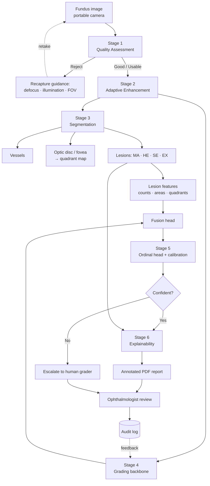
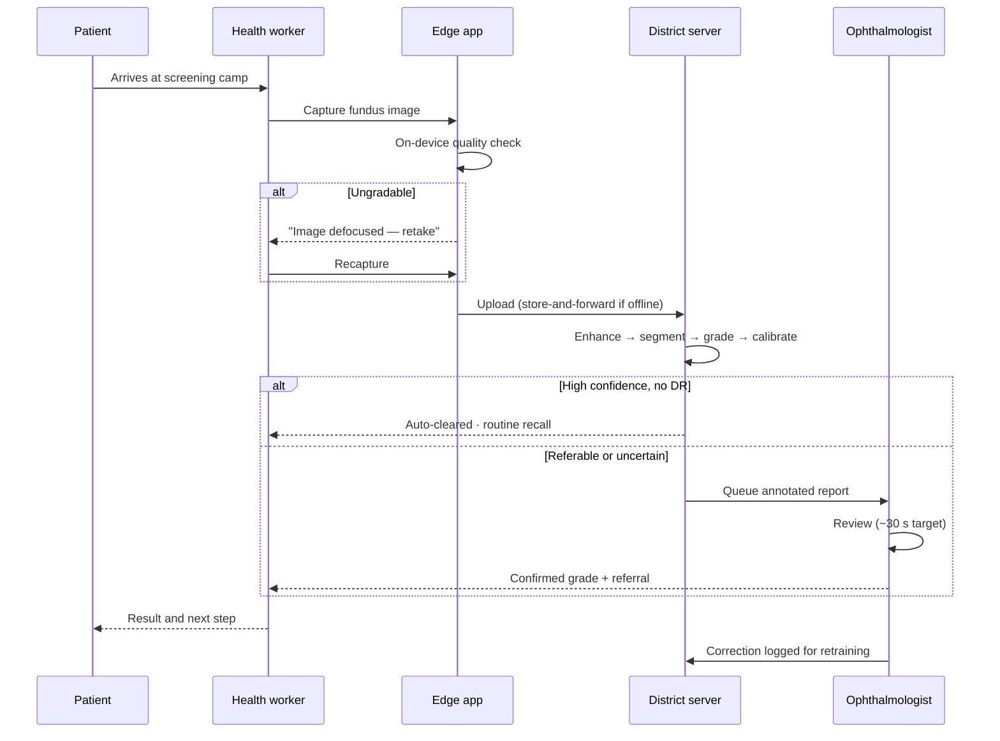
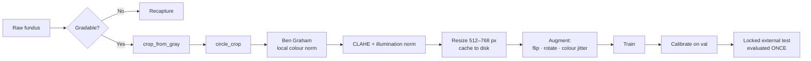

<div align="center">

# Diabetic Retinopathy Detection

### Explainable, quality-aware AI for diabetic retinopathy screening in rural India — built to be audited, not just admired

[](docs/04_ROADMAP.md)
[-blue)](LICENSE)
[](#getting-started)
[](#tech-stack)
[](#ethical-boundary--intended-use)

[**Analysis**](docs/01_PROJECT_ANALYSIS.md) · [**Literature**](docs/02_LITERATURE_REVIEW.md) · [**Tech Stack**](docs/03_TECH_STACK.md) · [**Roadmap**](docs/04_ROADMAP.md) · [**Prototype Scope**](docs/05_PROTOTYPE_SCOPE.md) · [**Report Bug**](https://github.com/adarshcod30/Diabetic-Retinopathy-Detection/issues)

</div>

> **⚠️ Development status.** This repository is in **Phase 0** of a 20-week plan. The architecture,
> evidence base, and validation protocol are complete and documented; models are not yet trained.
> Every performance figure below is labelled **target** until it is measured on a locked test set.
> No unmeasured number is presented as a result.

---

## Table of Contents

- [Overview](#overview)
- [Key Features](#key-features)
- [Tech Stack](#tech-stack)
- [System Architecture](#system-architecture)
- [Application Flow](#application-flow)
- [Data & ML Pipeline](#data--ml-pipeline)
- [Results & Model Performance](#results--model-performance)
- [Deployment & Infrastructure](#deployment--infrastructure)
- [Prototype Scope](#prototype-scope-tier-p)
- [Project Structure](#project-structure)
- [Getting Started](#getting-started)
- [Usage](#usage)
- [Testing](#testing)
- [Roadmap](#roadmap)
- [Ethical Boundary & Intended Use](#ethical-boundary--intended-use)
- [Contributing](#contributing)
- [License](#license)
- [Contact](#contact)

---

## Overview

**Problem.** India has roughly **101 million adults with diabetes** (ICMR-INDIAB, *Lancet Diabetes &
Endocrinology* 2023 — 11.4 % weighted prevalence across 113,043 participants). Diabetic retinopathy
affects **14–17 %** of them, and there is approximately **one retina specialist per 1.26 million
people**. Manual screening at that scale is arithmetically impossible.

**Solution.** A seven-stage screening pipeline that assesses image quality before it grades, grades
using the International Clinical DR Severity Scale, and explains itself with lesion-level evidence a
clinician can verify in seconds — plus a discrete-event simulation of the district screening programme
the model would run inside.

**Why it is different.** Automated DR grading is a solved-enough problem: [Gulshan 2016](https://jamanetwork.com/journals/jama/fullarticle/2588763)
reached 97.5 % sensitivity, and [IDx-DR](https://www.nature.com/articles/s41746-018-0040-6) is
FDA-authorised. The unsolved problems are the ones this project targets:

1. **Explainability that is measured, not asserted.** Nearly every DR project ships a Grad-CAM and
   stops. This one runs [Adebayo's sanity checks](https://arxiv.org/abs/1810.03292) on the saliency
   method itself, then *quantifies* whether the heatmap lands on real lesions using IDRiD's
   pixel-level masks (pointing game, CAM–lesion IoU).
2. **Graceful failure on field images.** [Beede et al. (CHI 2020)](https://dl.acm.org/doi/10.1145/3313831.3376718)
   found that in 11 Thai clinics the dominant failure was ungradable images being silently rejected,
   wasting patient trips. Here, rejection returns an actionable reason: defocus, illumination, or
   field of view.
3. **Clinically grounded evidence.** Lesion segmentation feeds *both* the grade and the explanation,
   mapped onto the ICDR criteria — so the rationale is the same evidence the model actually used.

**Keywords:** `diabetic-retinopathy` `medical-imaging` `explainable-ai` `grad-cam` `deep-learning`
`pytorch` `image-segmentation` `fundus-photography` `computer-vision` `healthcare-ai` `ordinal-regression`
`model-calibration` `simpy` `rural-health` `screening`

---

## Key Features

| Feature | Description |
|---|---|
| **Quality gate with recapture guidance** | 3-class gradability model (EyeQ) fused with focus, illumination and FOV features; a rejected image returns *why*, so the operator can retake it while the patient is still seated |
| **Adaptive enhancement** | Ben Graham local-colour normalisation, CLAHE, illumination correction — every step ablated, none assumed |
| **Retinal structure segmentation** | Vessels (DRIVE), optic disc & fovea landmarks, and four lesion classes (MA, haemorrhage, hard/soft exudate) at pixel level |
| **Sub-pixel microaneurysm detection** | Candidate generation via morphological top-hat + matched filtering, then CNN classification — because MAs vanish under naïve downscaling |
| **Ordinal DR grading** | ICDR 0–4 with rank-consistent ordinal heads, not plain cross-entropy: grading 0 as 4 is not the same mistake as 0 as 1 |
| **Lesion-aware fusion** | CNN embedding concatenated with clinically meaningful lesion features (counts, areas, quadrant distribution) |
| **Calibrated confidence** | Temperature scaling with reliability diagrams and ECE; low-confidence cases escalate to a human grader |
| **Audited explainability** | Grad-CAM variants scored against ground-truth lesion masks, with sanity checks reported pass/fail |
| **Auto-generated clinical report** | Annotated PDF with lesion overlays, ICDR evidence table, and calibrated confidence — designed for a 30-second review |
| **Screening-programme simulation** | SimPy discrete-event model of a 100,000-patient/year district programme: bandwidth, throughput, grader capacity, ophthalmologist-hours freed |

---

## Tech Stack

| Layer | Technology |
|---|---|
| DL framework | PyTorch 2.x · PyTorch Lightning · timm |
| Medical imaging | MONAI · segmentation-models-pytorch |
| Classical CV | OpenCV · scikit-image · Albumentations |
| Explainability | pytorch-grad-cam (Grad-CAM / ++ / Score-CAM / Eigen-CAM) |
| Config & tracking | Hydra + OmegaConf · Weights & Biases |
| Metrics & statistics | torchmetrics · scikit-learn · scipy · statsmodels (bootstrap CI, DeLong, McNemar) |
| Simulation | SimPy *(optional Simulink mirror)* |
| Serving | FastAPI · ONNX Runtime · Docker |
| Demo | Gradio → HuggingFace Spaces |
| Reporting | ReportLab |
| Quality | ruff · pytest · pre-commit · GitHub Actions |

Rationale for every choice, including the MATLAB→open-source mapping: [`docs/03_TECH_STACK.md`](docs/03_TECH_STACK.md).

---

## System Architecture



**In plain language.** An image arrives from a portable camera in a primary health centre. Before
anything else, the system decides whether it is *gradable* — and if not, tells the operator exactly
what to fix. A gradable image is normalised for the wide variation in camera and lighting, then passed
down two parallel paths: one segments the retina's structures and lesions, the other classifies overall
severity. The two paths meet at a fusion head, because the lesions a clinician would look for are
exactly the features that should drive the grade. The result is calibrated into an honest probability;
uncertain cases go straight to a human. Confident cases produce a report whose explanation is grounded
in the same lesion evidence the model used — not a decorative heatmap. Every decision is logged, and
graders' corrections feed the next training round.

---

## Application Flow



The **on-device quality check is deliberate**: a round trip to the cloud to learn the image was blurry
is precisely the failure mode documented in Thailand. The check must complete while the patient is
still in the chair.

---

## Data & ML Pipeline

### Data sources

| Dataset | Size | Labels | Population | Role | Licence |
|---|---|---|---|---|---|
| [APTOS 2019](https://www.kaggle.com/c/aptos2019-blindness-detection) | 3,662 | ICDR 0–4 | **India** (Aravind, Madurai) | Primary training | Competition rules |
| [EyePACS 2015](https://www.kaggle.com/c/diabetic-retinopathy-detection) | 88,702 | ICDR 0–4 (noisy) | US | Pretraining *(cloud-side only)* | Competition rules |
| [IDRiD](https://ieee-dataport.org/open-access/indian-diabetic-retinopathy-image-dataset-idrid) | 516 | Grades + **pixel masks** + OD/fovea | **India** (Nanded) | Lesion segmentation, XAI ground truth | CC BY 4.0 |
| [Messidor-2](https://www.adcis.net/en/third-party/messidor2/) | 1,748 | Adjudicated grades | France | **Locked external test** | ADCIS terms |
| [DRIVE](https://drive.grand-challenge.org/) | 40 | Vessel masks | Netherlands | Vessel segmentation | Research use |
| EyeQ | 28,792 | Good / Usable / Reject | derived from EyePACS | Quality model | Research use |

> Raw images are **never committed**. `scripts/download_data.sh` fetches them; `data/manifests/` commits
> sha256 hashes so anyone can verify byte-identical inputs.

### Pipeline



**Cleaning & preparation.** Circle-crop removes the black surround and standardises the field of view;
`crop_from_gray` handles off-centre captures. **Ben Graham preprocessing** — subtracting a heavily
blurred copy to remove local average colour — is the single highest-value step, as established by the
Kaggle DR 2015 winner and used by most APTOS top solutions. Preprocessed images are cached once at
512 px, which shrinks APTOS from ~10 GB to ~200 MB and makes every subsequent epoch cheaper.

**Feature engineering.** Beyond learned features, the lesion branch yields *clinically named* features:
microaneurysm count, haemorrhage and exudate area, per-quadrant distribution (using the optic
disc–fovea axis), and distance-to-fovea. These are the ICDR criteria expressed numerically — they
improve the grade and simultaneously become the explanation.

**Training approach.**
- Two-stage: pretrain on EyePACS (or initialise from [RETFound](https://www.nature.com/articles/s41586-023-06555-x),
  a masked-autoencoder foundation model trained on 1.6 M retinal images), then fine-tune on APTOS.
- **Ordinal loss**, not cross-entropy — DR grades are ordered, and recent SOTA
  ([Dual-SwinOrd](https://www.mdpi.com/2306-5354/13/4/374), AOR-DR) confirms this matters.
- **Resolution is the dominant hyperparameter.** A microaneurysm is ~10 px on a 4288 px image; at
  224 px it is sub-pixel and physically destroyed. Sweep 384/512/768 early.
- **Patient-level splits** — both eyes of one patient must never straddle train and test.

**Evaluation metrics.** Quadratic Weighted Kappa (grading); sensitivity and specificity at the
referable-DR operating point (grade ≥ 2); AUROC; **AUPRC for lesion segmentation** (lesion pixels are
<0.1 % of an image, which makes AUROC flattering and near-meaningless); Expected Calibration Error;
all with bootstrap 95 % CIs, DeLong for AUC comparisons, and McNemar for paired sensitivity/specificity.

---

## Results & Model Performance

> **No results yet — models are not trained.** The table below states **targets** and the **published
> work they are benchmarked against**. It will be replaced with measured values, confidence intervals,
> and the full ablation once Phase 8 completes.

### Targets

| Metric | Target | Benchmark it is measured against |
|---|---|---|
| Referable DR sensitivity | **≥ 90 %** | Ting 2017: 90.5 % · IDx-DR: 87.2 % · Google/Aravind: 88.9 % |
| Referable DR specificity | **≥ 85 %** | Ting 2017: 91.6 % · IDx-DR: 90.7 % · Google/Aravind: 92.2 % |
| QWK (APTOS, 5-class) | **≥ 0.90** | Dual-SwinOrd SOTA: 0.9370 |
| Quality classification (EyeQ) | **≈ 0.90 acc** | VISTA: 0.9066 acc, 0.8868 F1 |
| Lesion AUPRC (IDRiD) | per-class, cross-validated | IDRiD ISBI-2018 challenge leaderboard |
| Calibration (ECE) | **< 0.05** after temperature scaling | — |
| Grad-CAM localisation | pointing-game accuracy vs IDRiD masks | *rarely reported — this is the contribution* |

### Published comparators

| Study | Task | Sensitivity | Specificity | AUC |
|---|---|---|---|---|
| [Gulshan 2016 (JAMA)](https://jamanetwork.com/journals/jama/fullarticle/2588763) | Referable DR, EyePACS-1 | 97.5 % | 93.4 % | 0.991 |
| [Ting 2017 (JAMA)](https://pubmed.ncbi.nlm.nih.gov/29234807/) | Referable DR, multiethnic | 90.5 % | 91.6 % | 0.936 |
| [Abràmoff 2018 (npj Digit Med)](https://www.nature.com/articles/s41746-018-0040-6) | mtmDR, **prospective primary care** | 87.2 % | 90.7 % | — |
| [Gulshan 2019 (JAMA Ophthalmol)](https://research.google/pubs/performance-of-a-deep-learning-algorithm-vs-manual-grading-for-detecting-diabetic-retinopathy-in-india/) | Referable DR, **Aravind, India** | 88.9 % | 92.2 % | 0.963 |
| same | Referable DR, **Sankara Nethralaya** | 92.1 % | 95.2 % | 0.980 |

> **A note on honesty:** a faithful reproduction of Gulshan 2016 scored AUC 0.951 on EyePACS but only
> **0.853 on Messidor-2**. External validation drops are the norm, not a failure. This project plans
> for that drop, reports it, and analyses the domain shift rather than re-tuning until it disappears.

The planned **ablation** — eleven configurations, one factor added per row, evaluated on the locked
test set with significance tests — is specified in
[§7 of the analysis](docs/01_PROJECT_ANALYSIS.md#7-the-ablation-that-answers-integrated--single-technique).

---

## Deployment & Infrastructure

| Concern | Approach |
|---|---|
| **Training** | Kaggle Notebooks (T4/P100, 30 GPU-h/week, EyePACS pre-mounted) — chosen because the dev machine has 28 GB free disk and EyePACS is ~90 GB |
| **Local development** | Apple M4 via PyTorch MPS — preprocessing, IDRiD segmentation, inference, explainability, demo |
| **Model export** | PyTorch → ONNX → ONNX Runtime (server), CoreML (Apple), TFLite (Android capture app) |
| **Serving** | FastAPI + ONNX Runtime in Docker (`linux/amd64` + `linux/arm64`, so Jetson/Raspberry Pi remain viable for a PHC) |
| **Edge** | On-device quality check so blur is caught before upload, not after |
| **Connectivity** | Store-and-forward queue; the simulation explicitly models 1–10 Mbps rural links and outages |
| **Public demo** | Gradio on HuggingFace Spaces (free CPU tier) |
| **CI/CD** | GitHub Actions — ruff, pytest, and an end-to-end single-image smoke test on CPU |
| **Monitoring** | Audit log of every prediction + grader override; drift review before any retraining |
| **Reproducibility** | Hydra configs, fixed seeds, sha256 data manifests; `make setup && make evaluate` reproduces the headline table |

---

## Project Structure

```
Diabetic-Retinopathy-Detection/
├── configs/                  # Hydra YAMLs — one per experiment; this IS the ablation grid
├── data/                     # gitignored (manifests are committed)
│   ├── raw/ interim/ processed/ external/
│   └── manifests/            # sha256 + labels + patient_id
├── docs/
│   ├── 01_PROJECT_ANALYSIS.md    # what this is, why it is hard, what "done" means
│   ├── 02_LITERATURE_REVIEW.md   # annotated evidence base
│   ├── 03_TECH_STACK.md          # tooling decisions and rationale
│   ├── 04_ROADMAP.md             # 20-week phased plan
│   └── 05_PROTOTYPE_SCOPE.md     # Tier-P: scaling down without breaking the science
├── notebooks/                # exploration only — logic lives in src/
├── src/drdetect/
│   ├── data/                 # datasets, patient-level splits, manifests
│   ├── quality/              # Stage 1 — gradability + recapture guidance
│   ├── enhance/              # Stage 2 — Ben Graham, CLAHE, illumination
│   ├── segmentation/         # Stage 3 — vessels, OD/fovea, lesions
│   ├── grading/              # Stage 4 — backbones, ordinal heads, fusion
│   ├── calibration/          # Stage 5 — temperature scaling, thresholds, uncertainty
│   ├── explain/              # Stage 6 — CAMs, sanity checks, localisation metrics, reports
│   ├── eval/                 # metrics, bootstrap CI, DeLong, McNemar
│   ├── serve/                # FastAPI + ONNX
│   └── utils/                # seeding, logging, io
├── simulation/
│   ├── simpy/                # Stage 7 — district screening programme model
│   └── simulink/             # optional .slx mirror
├── scripts/                  # benchmark_device.py · download_data.sh · preprocess.py · train.py · evaluate.py
├── tests/
├── models/                   # gitignored; released via GitHub Releases / HF Hub
└── .github/workflows/
```

---

## Getting Started

### Prerequisites

- Python **3.11** (not 3.13 — several CV/DL wheels still lag)
- ~20 GB free disk for local datasets
- A Kaggle account (for datasets and free GPU)
- Optional: CUDA GPU. Apple Silicon works via MPS for everything except large-scale training.

### Installation

```bash
git clone https://github.com/adarshcod30/Diabetic-Retinopathy-Detection.git
cd Diabetic-Retinopathy-Detection
```

```bash
conda create -n dr python=3.11 -y && conda activate dr
```

```bash
pip install -e ".[dev]"
```

```bash
python -c "import torch; print('MPS:', torch.backends.mps.is_available(), '| CUDA:', torch.cuda.is_available())"
```

### Get the data

Place your Kaggle token at `~/.config/kaggle/kaggle.json`, then:

```bash
bash scripts/download_data.sh --datasets aptos,idrid,drive
```

> Messidor-2 requires accepting [ADCIS terms](https://www.adcis.net/en/third-party/messidor2/) and is
> downloaded manually into `data/external/messidor2/`. **Do not** download EyePACS locally — it is
> ~90 GB; train against it on Kaggle instead.

### Preprocess

```bash
python scripts/preprocess.py --dataset aptos --size 512 --pipeline bengraham
```

---

## Usage

Grade a single image and produce an annotated PDF report:

```bash
python scripts/predict.py --image path/to/fundus.jpg --report out/report.pdf
```

Launch the interactive demo:

```bash
python -m drdetect.serve.demo
```

Run a training experiment (Hydra — every ablation row is a config override):

```bash
python scripts/train.py experiment=grading_effnetv2 data.image_size=512 loss=ordinal
```

Evaluate on the locked external test set:

```bash
python scripts/evaluate.py --checkpoint models/checkpoints/best.ckpt --split external_test --bootstrap 2000
```

Run the screening-programme simulation:

```bash
python -m simulation.simpy.district --patients-per-year 100000 --graders 4 --bandwidth-mbps 5
```

> Commands reflect the target interface; scripts land progressively through Phases 1–7. See
> [`docs/04_ROADMAP.md`](docs/04_ROADMAP.md) for what exists today.

---

## Testing

```bash
pytest -q
```

```bash
ruff check . && ruff format --check .
```

Test strategy:
- **Unit** — preprocessing determinism, circle-crop geometry, metric correctness against hand-computed
  cases, patient-level split integrity (*asserts no patient appears in two splits* — the leakage bug
  that silently inflates every published number)
- **Integration** — one image end-to-end on CPU, asserting a valid grade and a well-formed PDF
- **CI** — ruff + pytest + the smoke test on every push

---

## Roadmap

| Phase | Weeks | Milestone |
|---|---|---|
| 0 · Foundation | 1 | Repo, environment, data audit, manifests |
| 1 · Baseline | 2–3 | Baseline QWK on APTOS — a number to beat |
| **2 · Vertical slice** ⭐ | 4–5 | **JPEG in → annotated PDF out** |
| 3 · Grading depth | 6–8 | Resolution sweep, ordinal loss, pretraining → QWK ≥ 0.90 |
| 4 · Segmentation | 9–11 | Vessels, OD/fovea, four lesion classes, MA detector |
| 5 · Integration | 12–13 | Lesion fusion + calibration + uncertainty escalation |
| **6 · Rigorous XAI** ⭐ | 14–15 | **Sanity checks + measured CAM localisation** |
| 7 · Simulation | 16–17 | District programme model, ophthalmologist-hours freed |
| 8 · Validation | 18–19 | Full ablation on locked test set with significance tests |
| 9 · Release | 20 | ONNX, Docker, HF Spaces demo, model card |

Detail, exit criteria, and an explicit scope-cut order: [`docs/04_ROADMAP.md`](docs/04_ROADMAP.md).

**Known scope limit:** neovascularisation segmentation is *out of scope* — no public dataset provides
NV pixel masks. PDR is detected at image level and the gap is documented rather than papered over.

---

## Prototype Scope (Tier-P)

Development runs on a 16 GB Apple M4 with ~28 GB free disk. That constrains **compute**, not
data — after caching at 512 px, APTOS, IDRiD, Messidor-2 and DRIVE together occupy **0.4 GB**.

So the scale-down cuts compute and keeps every image:

| | Full (Tier-F) | **Prototype (Tier-P)** |
|---|---|---|
| APTOS / IDRiD / DRIVE / Messidor-2 | full | **full — unchanged** |
| EyePACS pretraining | 88,702 | 12–15k stratified, cached on Kaggle |
| Backbone | EfficientNetV2-S | EfficientNet-B0 |
| Resolution | 768 px | 512 px *(floor — below this microaneurysms vanish)* |
| Cross-validation | 5-fold + TTA | single split + hflip TTA |

**≈34× cheaper, zero task data discarded.** Every cut is a config override, reversible on
Kaggle without re-splitting or re-collecting anything.

Two things are never scaled down: the **test set** (a 50-case test set gives a ±8.5 pp
confidence interval, which makes a ">90 % sensitivity" claim unmakeable) and the **validation
protocol**. Grade 3 has only 193 images in all of APTOS — subsampling collapses it to 15–38
training examples long before the dataset merely looks small.

Full arithmetic and the claims that do and don't survive: [`docs/05_PROTOTYPE_SCOPE.md`](docs/05_PROTOTYPE_SCOPE.md).

## Ethical Boundary & Intended Use

**This is a research prototype. It is not a medical device and must not be used for clinical
diagnosis.**

- Software intended for diagnosis falls under **CDSCO** medical-device rules in India; the comparable
  US system (IDx-DR) required an FDA De Novo authorisation. This project has neither and seeks neither.
- Outputs are **decision support with a human in the loop**, never a diagnosis. Every generated report
  carries the disclaimer.
- **Training populations are documented and limited:** APTOS and IDRiD are Indian, EyePACS is US,
  Messidor-2 is French. Performance on any other population is **unverified**.
- No patient-identifying data is stored in this repository; demo images are EXIF-stripped.
- Released weights are **research use only**, consistent with the licences of the data they derive from.

---

## Contributing

Contributions are welcome — particularly clinical review of the explanation format, additional external
validation datasets, and reproductions of the ablation.

1. Fork and branch (`git checkout -b feature/your-feature`)
2. `pre-commit install`
3. Add tests for anything you change
4. Ensure `pytest` and `ruff check .` pass
5. Open a pull request describing *what you measured*, not only what you changed

Findings that contradict results here are especially welcome. Please open an issue with the
configuration and seed.

---

## License

Code is released under the **MIT License** — see [LICENSE](LICENSE).

**Data and weights are not.** Datasets remain under their original licences (IDRiD CC BY 4.0;
APTOS/EyePACS competition rules; Messidor-2 ADCIS terms; DRIVE research use). Raw images are never
redistributed here. Trained weights derived from research-use data are released for **research use
only**.

---

## Contact

**Adarsh Dwivedi** · [@adarshcod30](https://github.com/adarshcod30)
Project: <https://github.com/adarshcod30/Diabetic-Retinopathy-Detection>

## Acknowledgments

The datasets that make this possible: [APTOS](https://www.kaggle.com/c/aptos2019-blindness-detection)
(Aravind Eye Hospital), [IDRiD](https://idrid.grand-challenge.org/) (Porwal et al.),
[Messidor-2](https://www.adcis.net/en/third-party/messidor2/) (ADCIS), and
[DRIVE](https://drive.grand-challenge.org/). Full evidence base:
[`docs/02_LITERATURE_REVIEW.md`](docs/02_LITERATURE_REVIEW.md).
