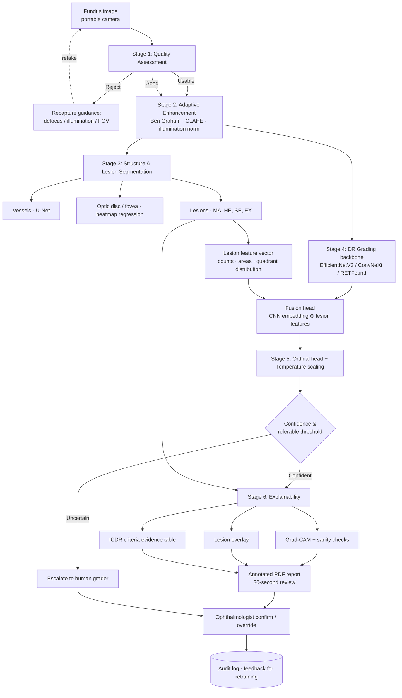

# Project Analysis — Explainable AI for Diabetic Retinopathy Screening

> **Status:** Pre-implementation analysis, v1.0
> **Author:** Adarsh Dwivedi
> **Scope:** What this project actually is, what makes it hard, what "done" means, and what the
> evidence says about each design decision.

---

## 1. Reading the problem statement critically

The brief originates as a MathWorks-style challenge statement. Before building anything, it is worth
separating **what is clinically real** from **what is marketing framing**, because an evidence-based
project must not inherit unverified claims.

| Claim in the brief | What the literature actually supports | Verdict |
|---|---|---|
| "India has over 77 million diabetic adults" | IDF Atlas 2019 projected **77 M**; ICMR-INDIAB (Lancet D&E, 2023) measured **11.4 %** weighted prevalence across 113,043 people, implying **~101 M** adults with diabetes as of 2021. | ⚠️ Understated — use ICMR-INDIAB, it is the stronger Indian evidence |
| "DR affects ~18 % of this population" | SMART India (Lancet Global Health, 2022) and a 2022 systematic review put DR at **~17.4 % urban / 14.0 % rural**; national survey 2015–19 reports **12.5 %**. | ✅ Roughly right, but cite a range (12–17 %) not a point estimate |
| "~1 ophthalmologist per 100,000 rural population" | Better-sourced figure: **1 retina specialist per ~1.26 million** people in India. Ophthalmologist density overall is higher, but *retina* capacity is the true bottleneck. | ⚠️ Reframe: the scarcity is in **retina specialists**, not ophthalmologists generally |
| "Early screening can prevent 90 % of vision loss" | Widely repeated public-health figure; traceable to timely treatment efficacy, not to screening alone. | ⚠️ Attribute carefully or soften |
| "Existing AI solutions function as black boxes, lack clinical validation rigor" | **Partly false.** IDx-DR completed an FDA pivotal trial (Abràmoff et al., *npj Digital Medicine* 2018) and is FDA-authorised. Google's ARDA was prospectively validated in India (Aravind + Sankara Nethralaya, n=3,049). | ❌ Overstated — the honest gap is **explainability + graceful behaviour on poor-quality field images**, not absence of validation |

**Consequence for this project:** the defensible novelty is **not** "first AI for DR." It is:

1. **Quantified explainability** — most projects show a Grad-CAM and stop. This project will *measure*
   whether the heatmap actually lands on real lesions, using IDRiD's pixel-level masks, and will run
   Adebayo-style sanity checks on the saliency method itself.
2. **Quality-aware graceful degradation** — the Thailand deployment study (Beede et al., CHI 2020)
   found the dominant real-world failure was *ungradable images being rejected wholesale*, wasting
   patient trips. A recapture-guidance loop is a genuine contribution.
3. **Evidence-linked reporting** — mapping detected lesions onto the ICDR severity criteria so a
   grader sees *why*, not just *what*.
4. **A reproducible ablation** proving the integrated pipeline beats each single technique.

---

## 2. The clinical target: what we are actually predicting

### 2.1 The International Clinical DR Severity Scale (ICDR)

| Grade | Name | Defining findings |
|---|---|---|
| 0 | No apparent DR | No abnormalities |
| 1 | Mild NPDR | **Microaneurysms only** |
| 2 | Moderate NPDR | More than MAs only, but less than severe |
| 3 | Severe NPDR | 4-2-1 rule: >20 intraretinal haemorrhages in each of 4 quadrants, **or** venous beading in ≥2 quadrants, **or** prominent IRMA in ≥1 quadrant |
| 4 | Proliferative DR | Neovascularisation **or** vitreous/preretinal haemorrhage |

**Referable DR = grade ≥ 2.** This is the binary decision that actually matters operationally, and the
one the sensitivity/specificity targets attach to.

### 2.2 Why grade 1 is the hardest class

Grade 1 is defined by microaneurysms *alone*. An MA is a **20–200 µm** capillary outpouching. On a
4288×2848 fundus image it spans roughly **5–15 pixels**. If you resize to the CNN-convenient 224×224,
an MA becomes **sub-pixel** — it is *physically destroyed by the resize*, not merely hard to see.

```
Original 4288 px wide  →  MA ≈ 10 px  →  0.23 % of width
Resized to 224 px      →  MA ≈ 0.5 px  →  GONE
Resized to 512 px      →  MA ≈ 1.2 px  →  barely 1 pixel
Resized to 1024 px     →  MA ≈ 2.4 px  →  marginally detectable
```

> **This single fact drives more architectural decisions than anything else in the project.** It is why
> the brief says "sub-pixel microaneurysm detection," why input resolution is a first-class
> hyperparameter, and why a patch-based or hybrid classical+DL MA detector is required rather than a
> plain whole-image CNN.

---

## 3. Published performance — the bar we must clear

These are the numbers a reviewer will compare against. Anything we report must be measured the same
way (same task definition, same operating point, with confidence intervals).

| Study | Task | Data | Sensitivity | Specificity | AUC |
|---|---|---|---|---|---|
| Gulshan et al., *JAMA* 2016 | Referable DR | EyePACS-1 (9,963 imgs) | 97.5 % | 93.4 % | 0.991 |
| Gulshan et al., *JAMA* 2016 | Referable DR | Messidor-2 | 96.1 % | 93.9 % | 0.990 |
| Ting et al., *JAMA* 2017 (SELENA) | Referable DR | Singapore NDRSP, multiethnic | 90.5 % | 91.6 % | 0.936 |
| Ting et al., *JAMA* 2017 | Vision-threatening DR | same | 100 % | 91.1 % | 0.958 |
| Abràmoff et al., *npj Digit Med* 2018 (IDx-DR) | mtmDR, **autonomous, primary care** | 900 pts, prospective | 87.2 % | 90.7 % | — |
| Gulshan et al., *JAMA Ophthalmol* 2019 | Referable DR | **Aravind Eye Hospital, India** | 88.9 % | 92.2 % | 0.963 |
| Gulshan et al., 2019 | Referable DR | **Sankara Nethralaya, India** | 92.1 % | 95.2 % | 0.980 |
| Dual-SwinOrd (2025) | 5-class grading | APTOS-2019 | — | — | **QWK 0.9370**, Acc 87.98 % |
| RETFound (Nature 2023) | DR grading, transfer | IDRiD / APTOS / Messidor-2 | foundation-model baseline | | |

### Reading this table honestly

- The brief's targets (**>90 % sens, >85 % spec** for referable DR) are **below** what Gulshan 2016
  achieved but **in line with** SELENA and the FDA-cleared IDx-DR. They are realistic, not trivial.
- **The retrospective-vs-prospective gap is real.** IDx-DR's 87.2 % sensitivity in a *prospective
  primary-care* setting is lower than Gulshan's 97.5 % retrospective — the same phenomenon that will
  hit us if we tune on APTOS and never test externally.
- **Note the ceiling illusion:** a reproduction study of Gulshan reached AUC 0.951 on EyePACS but only
  **0.853 on Messidor-2** — a 10-point external-validation drop from the same architecture. Expect this.

**Our commitment:** report on a **locked, never-tuned external test set** (Messidor-2 and/or IDRiD),
with bootstrap 95 % CIs, at a pre-registered operating point.

---

## 4. Datasets — what each one is for

| Dataset | Size | Labels | Population | Role in this project | Approx. disk |
|---|---|---|---|---|---|
| **APTOS 2019** | 3,662 train / 1,928 test | 5-class ICDR | **India** (Aravind, Madurai) | Primary grading train set | ~10 GB |
| **EyePACS / Kaggle DR 2015** | 88,702 | 5-class (noisy) | US, multi-camera | Pretraining only | ~90 GB ⚠️ |
| **IDRiD** | 516 | 5-class + **pixel masks** (MA/HE/SE/EX) + OD/fovea coords | **India** (Nanded, MH) | Lesion segmentation + XAI ground truth | ~2.5 GB |
| **Messidor-2** | 1,748 (874 exams) | Adjudicated grades | France | **Locked external test** | ~5 GB |
| **DRIVE** | 40 | Vessel masks | Netherlands | Vessel segmentation | ~100 MB |
| **EyeQ** | 28,792 | Good / Usable / Reject | derived from EyePACS | Image-quality model | subset of EyePACS |
| **DDR** (optional) | 13,673 | grades + lesion annots | China | Extra lesion supervision | ~8 GB |

### ⚠️ Hard constraint discovered on your machine

```
Apple M4 · 16 GB unified memory · 28 GB free disk
```

**28 GB free will not hold EyePACS.** This is the binding constraint on the whole project — more than
compute. Three viable strategies, in order of preference:

1. **Cloud-train / local-infer (recommended).** Keep EyePACS *only* on Kaggle or Colab, where it is
   already mounted as a dataset with zero local download. Train there on a free T4/P100. Pull down
   only the ~200 MB checkpoint. Locally keep APTOS + IDRiD + DRIVE (~13 GB) for development,
   evaluation and the demo.
2. **External SSD** for `data/` — cleanest if you have one; symlink `data/raw`.
3. **Skip EyePACS pretraining**, start from ImageNet or RETFound weights. Costs some accuracy but is
   entirely defensible and keeps everything on-disk.

> **Note on IDRiD's size:** only **81 images** carry pixel-level lesion masks. That is a very small
> segmentation training set — heavy augmentation, patch sampling, and transfer from a vessel model are
> mandatory, and any reported segmentation metric needs cross-validation, not a single split.

### Licensing (matters, because you want others to reuse this)

- APTOS / EyePACS — Kaggle competition rules; **research use**, redistribution restricted.
- IDRiD — CC BY 4.0 (free to use with attribution).
- Messidor-2 — requires accepting ADCIS terms; **do not redistribute**.
- DRIVE — research use, registration required.

**Therefore:** ship *code + trained weights + download scripts*, never the raw images. Weights derived
from research-use data should be released for **research use only** — state this in the model card.

---

## 5. System architecture



### Why this shape and not a single end-to-end CNN

A single CNN can hit good QWK on APTOS. It cannot:
- tell a health worker *why* an image was rejected,
- produce evidence a grader can verify in 30 seconds,
- give you an ablation showing integration beats any single technique — which the brief explicitly requires.

The lesion branch is doing **double duty**: it improves the grade (feature fusion) *and* it is the
explanation. That is the architectural idea worth defending.

---

## 6. Stage-by-stage design decisions

### Stage 1 — Image quality assessment

**Approach:** hybrid, because it gives both accuracy and an actionable *reason*.

- **Learned branch:** EfficientNet-B0 or MobileNetV3-Small, 3-class (Good / Usable / Reject), trained
  on **EyeQ** (28,792 labelled images). Published baselines on EyeQ sit around **0.90 accuracy**
  (e.g. VISTA: acc 0.9066, F1 0.8868) — that is the number to beat or match.
- **Handcrafted branch** (this is what generates the recapture message):
  - *Focus* — variance of Laplacian, Tenengrad gradient energy
  - *Illumination* — mean/σ of intensity across concentric FOV zones; detects vignetting and flash blowout
  - *Field of view* — fit the circular retinal boundary; flag truncation
  - *Vessel visibility* — response of a Frangi filter in the central zone
- **Fusion:** gradient boosting over [CNN logits ⊕ handcrafted features] → gradability + failure reason.

**Design rationale (Beede et al., CHI 2020):** in the Thailand deployment, images captured in
non-darkened rooms were degraded and silently rejected, and nurses lost trust. The reject path must be
*informative*, not a dead end.

### Stage 2 — Adaptive enhancement

| Technique | What it does | Caution |
|---|---|---|
| **Ben Graham preprocessing** | `4·img − 4·GaussianBlur(img, σ=r/30) + 128` — removes local average colour, normalising camera/illumination differences | The single highest-value trick; won Kaggle DR 2015 and is used by most APTOS top solutions |
| **CLAHE** on green channel / LAB-L | Local contrast; makes MAs and exudates pop | Clip limit too high amplifies noise into false MAs |
| **Illumination normalisation** | Large-kernel median background subtraction / retinex | Can flatten genuine haemorrhage contrast |
| **Circle crop + gray-border removal** | Removes black surround, standardises FOV | Must be robust to off-centre captures |
| **Denoising (NLM / BM3D)** | Sensor noise | ⚠️ **Highest-risk step.** An MA is 1–3 px after resize; a denoiser cannot distinguish it from noise. Apply *before* downscaling, conservatively, or not at all. |

**Rule for this project:** every enhancement step must be **ablated**, not assumed. If CLAHE does not
improve held-out referable-DR sensitivity, it does not ship. This turns Section 2 of the brief from a
checkbox into evidence.

### Stage 3 — Segmentation

**Vessels** — U-Net on DRIVE (+ STARE, CHASE_DB1 for generalisation). Reference performance on DRIVE
is roughly **Dice ≈ 0.81–0.83, AUC ≈ 0.98**. With only 40 images, patch-based training (48×48 or
64×64 patches) is the standard protocol.

**Optic disc & fovea** — heatmap regression (Gaussian target at the landmark, MSE/soft-argmax) is more
robust than bounding-box detection on 516 IDRiD images. OD localisation also *helps grading*: ICDR's
severity rules are quadrant-relative, and the OD–fovea axis defines the quadrants.

**Lesions** — the hard part. Four classes with wildly different scales:

| Lesion | Typical size | Strategy |
|---|---|---|
| Microaneurysm | 5–15 px @ full res | **Candidate-then-classify**: morphological top-hat on green channel + matched filtering to propose candidates, then a small CNN to accept/reject. Pure semantic segmentation under-detects these. |
| Haemorrhage | 20–200 px | U-Net / DeepLabv3+ at 1024 px |
| Hard exudate | 10–100 px, high contrast | Easiest class; U-Net works well |
| Soft exudate (CWS) | 30–150 px, fuzzy | U-Net; fewest training examples |

- **Loss:** Dice + Focal, or **Tversky with β > α** to bias toward recall (missing a lesion is worse
  than a false one, clinically).
- **Metric:** report **AUPRC**, not AUROC — lesion pixels are <0.1 % of the image, so AUROC is
  flattering and near-meaningless here. This is exactly what the IDRiD challenge used.
- **Neovascularisation** — the brief asks for it, but **no public dataset has NV pixel masks**. Honest
  scope call: detect PDR (grade 4) at *image level* and treat NV segmentation as documented future
  work rather than silently faking it.

### Stage 4 — DR grading

- **Backbone options, in order of practicality on your hardware:**
  1. `EfficientNetV2-S` @ 512–768 px — best accuracy/compute ratio, trains on a free Colab T4
  2. `ConvNeXt-Tiny` — strong, simple, good MPS support for local inference
  3. `RETFound` (ViT-Large, MAE-pretrained on 1.6 M retinal images) — highest ceiling, but ViT-L
     fine-tuning is heavy; use as the "if resources allow" arm
- **Resolution is the #1 hyperparameter**, per Section 2.2. Run the resolution sweep (384 / 512 / 768)
  *early* — it will dominate your architecture choice.
- **Loss — treat grading as ordinal, not categorical.** Grade 0 mistaken for 4 is far worse than 0→1,
  and plain cross-entropy is blind to that. Options:
  - regression + learned thresholds (the classic Kaggle approach, optimises QWK directly)
  - **CORAL / CORN** ordinal heads (rank-consistent, well-founded)
  - distance-aware label smoothing
  Recent SOTA (Dual-SwinOrd, AOR-DR) confirms ordinal formulation beats plain classification.
- **Class imbalance:** APTOS is ~49 % grade 0. Use class-balanced sampling *or* loss weighting — not
  both, or you over-correct.
- **Fusion head:** concatenate the CNN embedding with lesion-derived features (MA count, EX area, HE
  area per quadrant, SE present, NV suspected). These are literally the ICDR criteria — so the fusion
  is *clinically motivated*, not just an accuracy hack, and it is what makes the explanation faithful.

### Stage 5 — Calibration and the operating point

This is where most student projects quietly fail and where yours can visibly succeed.

- **Neural networks are systematically overconfident** (Guo et al., 2017). Raw softmax is not a
  probability. Fit **temperature scaling** on a held-out validation split; report **ECE** before/after
  and a reliability diagram.
- **Choose the referable threshold on validation, then freeze it.** Pick the threshold achieving
  ≥90 % sensitivity, then report whatever specificity results on the *test* set. Choosing the
  threshold on test is the most common silent cheat in this literature.
- **Uncertainty → human escalation.** MC-dropout or a small deep ensemble; route the least-confident
  *k* % to a grader. Then report the **sensitivity/specificity of the AI+human system**, not just the
  AI — that is the actual deployed system, and it is a stronger result.

### Stage 6 — Explainability, done rigorously

Everyone ships a Grad-CAM. Almost nobody checks whether it means anything. **This is your
differentiator.**

1. **Grad-CAM / Grad-CAM++ / Score-CAM** on the final convolutional block.
2. **Sanity checks (Adebayo et al., NeurIPS 2018)** — mandatory, and rarely done in DR papers:
   - *Model randomisation test*: progressively randomise layer weights. If the saliency map barely
     changes, it is acting as an edge detector, not an explanation.
   - *Data randomisation test*: retrain on shuffled labels. The map should degrade.
   A method that fails these does not go in the report.
3. **Quantified localisation — the novel bit.** IDRiD gives pixel-level lesion masks. So compute:
   - *Pointing game* — does the Grad-CAM peak fall inside a true lesion?
   - *IoU / lesion-coverage* between thresholded CAM and ground-truth masks.
   This converts "the heatmap looks plausible" into a **number a clinician can audit**. Independent
   work has shown saliency maps are often untrustworthy for abnormality localisation in medical
   imaging — measuring it is the responsible move.
4. **Lesion overlay beats heatmap.** Showing outlined MAs/exudates from the segmentation branch is
   far more clinically legible than a diffuse blob.
5. **ICDR evidence table** → auto-generated rationale, e.g.
   *"Grade 2 (Moderate NPDR). Evidence: 14 microaneurysms (3 superotemporal, 6 inferotemporal,
   5 nasal); hard exudates 0.8 % of retinal area; no venous beading or IRMA detected.
   Calibrated confidence 0.87."*
6. **30-second review target** — measure it. Time yourself (or a willing MBBS friend) reviewing 20
   reports. A stated UX target with no measurement is not evidence.

### Stage 7 — Screening-programme simulation

**Reality check: MATLAB/Simulink is not installed on your machine, and there is no free public
runtime for it.** Options:

| Option | Pro | Con |
|---|---|---|
| **SimPy** (Python discrete-event sim) — *recommended primary* | Free, reproducible, runs in CI, anyone can `pip install` and re-run your result | Not literally "Simulink" if this is graded against the brief |
| **MATLAB Online** (free tier ~20 h/month, or LNMIIT student licence) | Satisfies the letter of the brief; Simulink is genuinely good at this | Not reproducible for outside users; hour-limited |
| **Both** — SimPy as the in-repo reproducible model, Simulink as a mirrored `.slx` + screenshots | Best of both | Extra work |

**What the model must answer** (district programme, 100,000 patients/year):

- **Arrivals:** ~400 patients/working day across *N* camps; images/patient = 2 eyes × 1–2 fields.
- **Bandwidth:** rural links 1–10 Mbps, intermittent. A 4288×2848 JPEG is ~4 MB. Model upload latency
  and a store-and-forward queue for outages.
- **Inference throughput:** measured from your own model (images/sec on the target device) — not guessed.
- **Human review capacity:** graders × reports/hour × availability. This is the true bottleneck.
- **Outputs to optimise:** end-to-end turnaround time, grader utilisation, backlog under outage,
  cost per screened patient, and **how much review capacity the AI's auto-clear rate actually frees.**

The last one is the money question: if the model auto-clears 60 % of grade-0 images at high
confidence, how many ophthalmologist-hours does that return to the district? That number, not the
QWK, is what a health administrator will act on.

---

## 7. The ablation that answers "integrated > single technique"

The brief demands proof that the integrated pipeline beats any single approach. Design it up front as
a single table, evaluated **on the locked external test set**:

| # | Configuration | QWK | Sens @ referable | Spec @ referable | AUROC | ECE |
|---|---|---|---|---|---|---|
| 1 | Backbone only, 224 px, ImageNet init, CE loss | | | | | |
| 2 | + resolution 512 | | | | | |
| 3 | + Ben Graham preprocessing | | | | | |
| 4 | + CLAHE / illumination normalisation | | | | | |
| 5 | + ordinal loss | | | | | |
| 6 | + EyePACS pretraining (or RETFound init) | | | | | |
| 7 | + quality gating (reject ungradable) | | | | | |
| 8 | + lesion-feature fusion | | | | | |
| 9 | + ensemble & TTA | | | | | |
| 10 | + temperature calibration | | | | (unchanged) | ↓ |
| 11 | **Full pipeline + human escalation of uncertain cases** | | | | | |

Each row adds exactly one factor. Report Δ per row with bootstrap CIs, and use **DeLong's test** for
AUC differences and **McNemar's test** for paired sensitivity/specificity. That is the difference
between a project and a result.

---

## 8. Validation rigour — the five things that will otherwise sink this

1. **Split by patient, not by image.** Messidor-2 and EyePACS contain both eyes of the same patient.
   Left and right eye of one person landing in train and test is textbook leakage and will inflate
   every number you report.
2. **Lock an external test set on day one.** Train on APTOS (+EyePACS), test on Messidor-2/IDRiD, and
   touch it exactly once. Expect the ~10-point AUC drop the Gulshan reproduction study saw — reporting
   it honestly is *stronger* than hiding it.
3. **Confidence intervals on everything.** Bootstrap (2,000 resamples) sensitivity, specificity, AUROC,
   QWK. A point estimate of "91.3 % sensitivity" on 400 test images means very little without its CI.
4. **Subgroup analysis.** Report metrics stratified by image-quality tier and, if metadata allows,
   camera type. A model that is 94 % sensitive on "Good" images and 71 % on "Usable" ones is a
   deployment hazard that a pooled number conceals.
5. **Fixed seeds, versioned configs, hashed data manifests.** Someone must be able to reproduce
   Table 7 from a clean clone.

---

## 9. Honest risk register

| Risk | Likelihood | Impact | Mitigation |
|---|---|---|---|
| **Disk exhaustion (28 GB free)** | High | Blocks training entirely | Cloud-train on Kaggle/Colab; external SSD; skip EyePACS |
| Grade-1 recall stays poor | High | Caps referable-DR sensitivity | High resolution + candidate-based MA detector + ordinal loss |
| 81 lesion-mask images overfit | High | Segmentation numbers not credible | Cross-validation, heavy augmentation, transfer from vessel model, add DDR |
| External validation drop | Certain | Looks like failure if unplanned | Plan for it, report it, analyse *why* (domain shift) |
| Grad-CAM fails sanity checks | Medium | Explainability claim collapses | Have Score-CAM/lesion-overlay as fallback; report the negative result — it is still a finding |
| Simulink unavailable | Certain locally | Brief requirement unmet | SimPy primary + MATLAB Online mirror |
| Scope sprawl (7 subsystems) | High | Nothing finishes | Ship the vertical slice first (§ roadmap Phase 2), then deepen |
| Over-claiming clinical readiness | Medium | Ethical + reputational | Model card with explicit "not a medical device" statement |

---

## 10. What "done" looks like

A working prototype is credible when all of these are true:

- [ ] Referable-DR **sensitivity ≥ 90 %, specificity ≥ 85 %** on a *locked external* test set, with 95 % CIs
- [ ] QWK reported on APTOS with a like-for-like comparison to published numbers
- [ ] Lesion segmentation reported as **AUPRC** per class on IDRiD, cross-validated
- [ ] Quality model matched against EyeQ published baselines (~0.90 acc)
- [ ] Grad-CAM passes Adebayo sanity checks **and** has a measured pointing-game / IoU score against IDRiD masks
- [ ] Calibration: ECE and reliability diagram, before and after temperature scaling
- [ ] The full ablation table (§7) filled in with significance tests
- [ ] Simulation answering the ophthalmologist-hours-freed question for 100k patients/year
- [ ] Reproducible: clean clone → `make setup` → `make evaluate` reproduces the headline table
- [ ] Model card + dataset card + explicit non-medical-device disclaimer
- [ ] Public demo (HF Spaces) and released weights

---

## 11. Ethical and legal boundary

This is a **research prototype, not a medical device.** In India, software intended for diagnosis
falls under CDSCO's medical-device rules; in the US, IDx-DR required a De Novo authorisation. This
project must:

- carry a prominent **"not for clinical use"** notice in the README, the app UI, and every generated report;
- never present an output as a diagnosis — only as decision support with a human in the loop;
- store no patient-identifying data in the repo, and strip EXIF from any demo images;
- state clearly in the model card which populations the training data represents (APTOS/IDRiD = Indian,
  EyePACS = US, Messidor-2 = French) and where performance is therefore unverified.

---

## References

Full annotated bibliography with links: [`02_LITERATURE_REVIEW.md`](02_LITERATURE_REVIEW.md)
