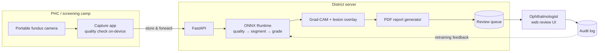

# Tech Stack & Prerequisites

Chosen for **your actual machine** (Apple M4, 16 GB unified memory, ~28 GB free disk) and for the goal
that *anyone* can clone this repo and reproduce it.

---

## 1. The core decision: where does training happen?

| | Local (M4, MPS) | Kaggle Notebooks | Google Colab |
|---|---|---|---|
| GPU | Apple Metal (MPS) | **T4 ×2 / P100** free | T4 free, A100 on Pro |
| Weekly quota | unlimited | **30 GPU-h/week** | ~dynamic, can be cut off |
| Disk | **28 GB free ⚠️** | ~70 GB + datasets **pre-mounted** | ~100 GB ephemeral |
| EyePACS access | ✗ won't fit | **✓ zero-download** | ✗ must download |
| Session limit | none | 12 h | ~12 h, less reliable |

### → Recommended split

- **Kaggle** — heavy training (EyePACS pretraining, resolution sweeps, the ablation grid). EyePACS and
  APTOS are already mounted there, which sidesteps your disk problem entirely.
- **Local M4** — data exploration, preprocessing development, unit tests, segmentation on IDRiD (small),
  inference, explainability, the Streamlit demo, and the SimPy simulation.
- **Never** attempt EyePACS locally.

> PyTorch's MPS backend is mature enough for inference and small-model training. It is *not* fast
> enough for a 512 px EfficientNetV2 across 88k images — expect roughly an order of magnitude slower
> than a T4, plus MPS gaps in some ops. Use it for what it is good at.

---

## 2. Language & framework

**Python 3.11** (not 3.13 — several CV/DL wheels still lag; you have 3.13.7 system-wide, so create a
dedicated 3.11 environment).

| Layer | Choice | Why this over the alternative |
|---|---|---|
| DL framework | **PyTorch 2.x** | Best MPS support; the entire DR/medical-imaging research ecosystem (MONAI, RETFound, timm) is PyTorch-first |
| Model zoo | **timm** | EfficientNetV2, ConvNeXt, Swin, ViT with pretrained weights in one line |
| Training loop | **PyTorch Lightning** | Free checkpointing, mixed precision, deterministic seeding, and device-agnostic code (same script runs on MPS and CUDA) |
| Medical imaging | **MONAI** | Battle-tested Dice/Tversky/Focal losses, sliding-window inference, medical augmentations |
| Segmentation | **segmentation-models-pytorch** | U-Net / DeepLabv3+ / FPN with any timm encoder |
| Augmentation | **Albumentations** | Fast, and correctly transforms image **and** mask together |
| Classical CV | **OpenCV** + **scikit-image** | Ben Graham preprocessing, CLAHE, morphology, Frangi vessel filter |
| Explainability | **pytorch-grad-cam** | Grad-CAM/++/Score-CAM/Eigen-CAM in one API — needed for the sanity-check comparison |
| Config | **Hydra** + OmegaConf | Every experiment is a YAML; the ablation table becomes a config sweep, not copy-pasted scripts |
| Tracking | **Weights & Biases** (free tier) or MLflow | You will run ~30 experiments for the ablation; you will not remember them |
| Metrics | **torchmetrics** + **scikit-learn** | QWK, AUROC, AUPRC, calibration error |
| Stats | **scipy** + **statsmodels** | Bootstrap CIs, DeLong, McNemar |
| Simulation | **SimPy** | Discrete-event screening-programme model, pure Python, runs in CI |
| Serving | **FastAPI** + **ONNX Runtime** | Framework-free deployment; ORT runs on CPU/edge devices a PHC can afford |
| Demo | **Streamlit** or **Gradio** | Gradio → free HuggingFace Spaces hosting |
| Reports | **ReportLab** or **WeasyPrint** | The annotated PDF for the grader |
| Quality | **ruff**, **pytest**, **pre-commit** | Non-negotiable if others are to reuse this |

### Deliberately *not* used
- **TensorFlow/Keras** — the metal plugin exists, but the DR research ecosystem and pretrained retinal
  weights (RETFound especially) are PyTorch. Mixing costs you more than it saves.
- **DVC** — worth it only once data versioning actually bites. Start with hashed manifests (see below).

---

## 3. MATLAB / Simulink — the honest position

The brief names Image Processing, Computer Vision, Deep Learning, Medical Imaging, and Statistics &
ML Toolboxes plus Simulink. **You have no MATLAB installed**, and MATLAB is not free.

| Brief's tool | Open-source equivalent used here | Parity |
|---|---|---|
| Image Processing Toolbox | OpenCV + scikit-image | Full |
| Computer Vision Toolbox | OpenCV + Albumentations | Full |
| Deep Learning Toolbox | PyTorch + timm | Full (better model zoo) |
| Medical Imaging Toolbox | MONAI | Full |
| Statistics & ML Toolbox | scipy + statsmodels + scikit-learn | Full |
| **Simulink** | **SimPy** | ⚠️ Different paradigm — see below |

**Simulink is the only genuine gap.** It is a graphical block-diagram simulator; SimPy is a
process-based discrete-event library. They model the same *system* but the artefact looks different.

**Recommendation:** build the SimPy model as the repo's reproducible primary. If you need the literal
Simulink deliverable (e.g. for a hackathon submission), LNMIIT very likely provides a MATLAB campus
licence, or MATLAB Online's free tier gives ~20 h/month — mirror the model there and commit the `.slx`
plus exported plots into `simulation/simulink/`.

---

## 4. Environment setup

```bash
# conda (miniforge is already on your machine) — arm64 native
conda create -n dr python=3.11 -y
conda activate dr

# PyTorch with Metal support
pip install torch torchvision --index-url https://download.pytorch.org/whl/cpu

# verify MPS is live
python -c "import torch; print('MPS available:', torch.backends.mps.is_available())"

pip install -r requirements.txt
pre-commit install
```

> `uv` is also installed on your machine and is dramatically faster —
> `uv venv --python 3.11 && uv pip install -r requirements.txt` works equally well.

---

## 5. Data management under a 28 GB ceiling

```bash
# 1. Kaggle API for dataset download
pip install kaggle
# place kaggle.json in ~/.config/kaggle/  (already .gitignore'd)

# 2. Pull ONLY what fits locally
kaggle competitions download -c aptos2019-blindness-detection -p data/raw/aptos
# IDRiD: manual download from IEEE DataPort (registration required)
# DRIVE: manual, grand-challenge registration

# 3. NEVER locally:
#    kaggle competitions download -c diabetic-retinopathy-detection   # ~90 GB
```

**Local budget:**

| Dataset | Size | Keep locally? |
|---|---|---|
| APTOS 2019 | ~10 GB | ✅ yes — primary train set |
| IDRiD | ~2.5 GB | ✅ yes — lesion masks + XAI ground truth |
| DRIVE | ~100 MB | ✅ yes |
| Messidor-2 | ~5 GB | ✅ yes — locked external test |
| EyePACS | ~90 GB | ❌ **Kaggle-side only** |
| **Local total** | **~18 GB** | leaves ~10 GB headroom |

**Preprocess once, cache as 512 px.** After Ben Graham + circle crop, write out `data/processed/` as
512 px JPEGs (~50 KB each). APTOS drops from 10 GB to ~200 MB, and every subsequent epoch reads faster.
This is the single highest-leverage disk trick in the project.

**Reproducibility without DVC:** hash every processed file into `data/manifests/<split>.csv`
(`path, sha256, patient_id, grade, quality`). Commit the manifest, not the data. Anyone can then verify
they have byte-identical inputs.

---

## 6. Prerequisite knowledge — what to actually learn

Ordered by when you will need it. Skip what you already have.

### Must have before starting
- **CNNs**: convolution, pooling, receptive field, batch norm, residual connections
- **Transfer learning**: freezing, discriminative learning rates, warmup
- **PyTorch**: `Dataset`/`DataLoader`, training loop, `autograd`, moving tensors across devices
- **Classification metrics**: confusion matrix, sensitivity/specificity, ROC vs PR curves,
  **and why PR is the right one under class imbalance**

### Need by Phase 2
- **Semantic segmentation**: U-Net, encoder–decoder, skip connections
- **Segmentation losses**: Dice, Focal, Tversky — and when each is right
- **Ordinal regression**: CORAL/CORN, or regression-with-thresholds
- **Quadratic Weighted Kappa** — how it is computed and why it is the DR-grading metric

### Need by Phase 3
- **Grad-CAM**: how gradients weight activation maps; why it is coarse
- **Calibration**: reliability diagrams, ECE, temperature scaling
- **Bootstrap CIs**, DeLong's test, McNemar's test

### Domain knowledge (a weekend, and non-optional)
- Fundus anatomy: optic disc, macula, fovea, arcades, quadrants
- DR lesions: microaneurysm vs dot haemorrhage (they look nearly identical — that distinction *is*
  the grade-1/grade-2 boundary), hard vs soft exudate, IRMA, venous beading, neovascularisation
- The **ICDR scale** and the **4-2-1 rule** for severe NPDR

> **Suggested resource:** the IDRiD paper's figures are the fastest way to learn what each lesion looks
> like, because they are annotated at pixel level on Indian-population images — the exact distribution
> you will be working in.

---

## 7. Deployment stack



- **Export path:** PyTorch → ONNX → (a) ONNX Runtime for server, (b) CoreML for on-device Apple,
  (c) TFLite for Android capture apps.
- **Why on-device quality check:** it must run *while the patient is still in the chair*. A round trip
  to the cloud to learn the image was blurry is exactly the failure Beede et al. documented.
- **Containerisation:** Docker, `linux/amd64` + `linux/arm64` (Raspberry Pi / Jetson are plausible PHC hardware).
- **CI:** GitHub Actions — ruff, pytest, and a smoke test that runs one image end-to-end on CPU.
- **Public demo:** Gradio on HuggingFace Spaces (free CPU tier is enough for single-image inference).

---

## 8. Repository layout

```
Diabetic-Retinopathy-Detection/
├── configs/                  # Hydra YAMLs — one per experiment, this IS the ablation table
├── data/                     # gitignored
│   ├── raw/ interim/ processed/ external/
│   └── manifests/            # committed: sha256 + labels + patient_id
├── docs/                     # analysis, literature, roadmap, model card
├── notebooks/                # exploration only — nothing important lives here
├── src/drdetect/
│   ├── data/                 # datasets, splits (patient-level!), manifests
│   ├── quality/              # Stage 1 — IQA + recapture guidance
│   ├── enhance/              # Stage 2 — Ben Graham, CLAHE, illumination norm
│   ├── segmentation/         # Stage 3 — vessels, OD/fovea, lesions
│   ├── grading/              # Stage 4 — backbones, ordinal heads, fusion
│   ├── calibration/          # Stage 5 — temperature scaling, thresholds, uncertainty
│   ├── explain/              # Stage 6 — CAMs, sanity checks, localisation metrics, reports
│   ├── eval/                 # metrics, bootstrap CIs, DeLong, McNemar
│   ├── serve/                # FastAPI + ONNX runtime
│   └── utils/                # seeding, logging, io
├── simulation/
│   ├── simpy/                # discrete-event screening model (primary)
│   └── simulink/             # optional .slx mirror
├── scripts/                  # download_data.sh, preprocess.py, train.py, evaluate.py, export.py
├── tests/
├── models/                   # gitignored; released via GitHub Releases / HF Hub
└── .github/workflows/
```

**Design principle:** `src/drdetect` is an installable package (`pip install -e .`). Notebooks import
from it; they never *contain* logic. That is what makes the work reusable by others rather than a pile
of notebooks.
