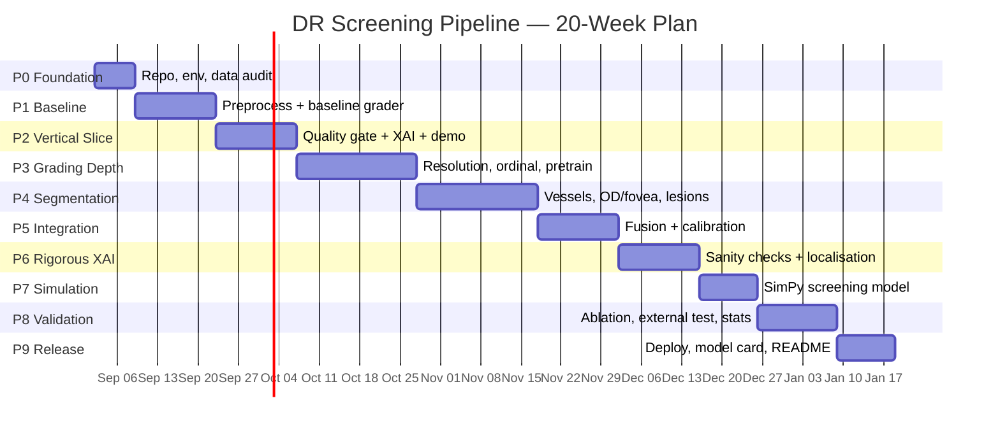

# Development Roadmap

**Assumption:** ~15–20 focused hours/week (a serious side project alongside coursework).
Total ≈ **20 weeks**. Every phase ends in something *demonstrable* — no phase is pure setup.

**Guiding principle: build the thin vertical slice first.** A mediocre end-to-end pipeline in week 5
is worth more than a brilliant segmentation model in week 14 with nothing around it. You can always
deepen a working slice; you cannot integrate three half-finished subsystems under deadline.

---

## Phase 0 — Foundation (Week 1)

**Goal:** a repo someone else could clone and run, and total clarity on what data you actually have.

- [x] Git repo + GitHub remote
- [x] Directory scaffold, `.gitignore`, docs
- [ ] Python 3.11 env; verify `torch.backends.mps.is_available()`
- [ ] `pyproject.toml` — installable `drdetect` package; ruff + pre-commit + pytest skeleton
- [ ] Download APTOS, IDRiD, DRIVE; request Messidor-2 access (**do this on day 1 — approval takes time**)
- [ ] **Data audit notebook**: class distribution, image sizes, camera types, duplicate detection,
      and *check whether APTOS has patient IDs* — if not, document the leakage risk explicitly
- [ ] Build `data/manifests/` with sha256 + labels
- [ ] **Run `make bench`** and fix the scope from measured throughput, not estimates
      (see [`05_PROTOTYPE_SCOPE.md`](05_PROTOTYPE_SCOPE.md))

**Exit criterion:** `pytest` passes on a clean clone; you can state the exact class distribution of
every dataset from memory.

> ⚠️ **Do first:** request Messidor-2 access. It is your locked external test set and gates Phase 8.

---

## Phase 1 — Baseline grader (Weeks 2–3)

**Goal:** a number to beat. Resist tuning.

- [x] Preprocessing module: `crop_from_gray` → `circle_crop` → Ben Graham → resize. Unit-tested.
- [x] Cache pipeline (`scripts/preprocess.py`) — parallel, resumable, builds the manifest
- [x] Split module — **APTOS ships no patient IDs**, so grouping is derived from perceptual
      hashing of source structure; `stratified_group_split` *refuses* to split ungrouped
      unless the caller opts in explicitly
- [x] Metrics module: QWK (validated against sklearn), sens/spec @ referable, bootstrap CIs, ECE
- [x] Baseline trainer (`scripts/train.py`) — EfficientNet-B0, frozen BN, cosine schedule,
      per-class recall logged every epoch
- [x] End-to-end integration test on a synthetic APTOS (76 tests total)
- [ ] **Download APTOS** (blocked: needs `kaggle.json`) ← only remaining step
- [ ] Run the real baseline and record the QWK
- [ ] W&B logging wired up (CSV logging works today)

**Exit criterion:** a logged baseline QWK on APTOS validation. Expect **~0.80–0.88**. Write the number
down; every future change is measured against it.

---

## Phase 2 — Thin vertical slice (Weeks 4–5) ⭐

**Goal:** image in → graded, explained PDF out. Ugly is fine. End-to-end is the point.

- [ ] Quality model v1: EfficientNet-B0 on EyeQ, 3-class (train on Kaggle)
- [ ] Handcrafted quality features (Laplacian variance, illumination zones, FOV fit) + failure reason
- [ ] Grad-CAM v1 on the baseline grader
- [ ] PDF report generator: image, CAM overlay, grade, confidence, disclaimer
- [ ] Gradio demo running locally on MPS
- [ ] `scripts/predict.py` — single image, CPU, no GPU required

**Exit criterion:** you can hand someone a fundus JPEG and get a PDF back. **Demo this.** It is the
moment the project becomes real, and it de-risks everything downstream.

---

## Phase 3 — Grading depth (Weeks 6–8)

**Goal:** push the grader to publishable quality. Most accuracy gain lives here.

- [ ] **Resolution sweep: 224 / 384 / 512 / 768.** Run this first — it will dominate everything else
      (see § 2.2 of the analysis: MAs are destroyed by downscaling)
- [ ] Backbone comparison: EfficientNetV2-S vs ConvNeXt-Tiny vs Swin-Tiny
- [ ] **Ordinal loss**: regression+thresholds vs CORAL/CORN vs distance-aware label smoothing
- [ ] Class-imbalance handling: balanced sampler *or* weighted loss (not both)
- [ ] EyePACS pretraining on Kaggle → fine-tune on APTOS. *Alternative if quota is tight:* RETFound init
- [ ] Augmentation study: flips, rotation, colour jitter, CLAHE-as-augmentation
- [ ] TTA + 5-fold ensemble

**Exit criterion:** QWK ≥ **0.90** on APTOS validation (Dual-SwinOrd reports 0.937 — that is SOTA, not
your target). Referable-DR sensitivity ≥ 90 % at the chosen operating point.

> **Watch for:** grade-1 recall will be your worst class by a wide margin. Track per-class recall every
> run, not just aggregate QWK — QWK will hide a total grade-1 failure.

---

## Phase 4 — Segmentation (Weeks 9–11)

**Goal:** the lesion evidence that powers both fusion and explanation.

- [ ] **Vessels** — U-Net on DRIVE, 48×48 patches. Target Dice ≈ 0.80+, AUC ≈ 0.97+
- [ ] **OD & fovea** — heatmap regression on IDRiD. Target: mean localisation error < 0.5 × OD diameter
- [ ] **Quadrant mapping** from OD–fovea axis (needed for ICDR's quadrant-based rules)
- [ ] **Lesions** — DeepLabv3+/U-Net on IDRiD (only **81 masked images** → 5-fold CV, heavy aug,
      patch sampling at full resolution)
  - [ ] Hard exudates first (easiest, highest contrast) — establishes the harness
  - [ ] Haemorrhages, soft exudates
  - [ ] **Microaneurysms last and separately**: morphological top-hat + matched filter candidate
        generation → small CNN classifier. Do *not* expect plain segmentation to work here.
- [ ] Report **AUPRC per lesion class** (AUROC is meaningless at <0.1 % positive pixels)

**Exit criterion:** per-class AUPRC on IDRiD with cross-validated CIs, plus qualitative overlays that
a clinician would recognise.

> **Scope honesty:** neovascularisation has no public pixel masks. Detect PDR at image level; document
> NV segmentation as future work. Do not fabricate it.

---

## Phase 5 — Integration & calibration (Weeks 12–13)

**Goal:** turn two models into one system that knows what it does not know.

- [ ] Lesion feature extractor: MA count, HE/EX/SE area, per-quadrant distribution, distance-to-fovea
- [ ] Fusion head: `concat(CNN embedding, lesion features)` → ordinal head
- [ ] Quality gating: route Reject → recapture, Usable → flag in report
- [ ] **Temperature scaling** on a held-out split; reliability diagram + ECE before/after
- [ ] Uncertainty: MC-dropout or deep ensemble
- [ ] **Operating point selection on validation only**, then frozen
- [ ] Human-escalation policy: route bottom-*k* % confidence to a grader; measure the AI+human system

**Exit criterion:** ECE < 0.05 after calibration; the fusion model beats the grading-only model with a
significant McNemar p-value.

---

## Phase 6 — Rigorous explainability (Weeks 14–15) ⭐ *the differentiator*

- [ ] Grad-CAM, Grad-CAM++, Score-CAM, Eigen-CAM side by side
- [ ] **Adebayo sanity checks**: model-randomisation and data-randomisation tests. Report which methods
      pass. *A negative result is a real result* — most DR papers never run this.
- [ ] **Quantified localisation vs IDRiD masks**: pointing game accuracy, CAM–lesion IoU, per-lesion-type
- [ ] Lesion-overlay rendering (outlines beat blobs for clinical legibility)
- [ ] ICDR evidence table → templated natural-language rationale
- [ ] Final PDF report design
- [ ] **Measure the 30-second target**: time ≥20 report reviews; report mean ± SD. Recruit an MBBS
      student if possible — even n=1 clinician feedback beats none

**Exit criterion:** a table of saliency methods × (sanity-check pass/fail, pointing-game accuracy,
IoU). This is the most novel artefact in the project.

---

## Phase 7 — Screening-programme simulation (Weeks 16–17)

- [ ] SimPy discrete-event model: camps → capture → upload → inference → triage → human review
- [ ] Parameterise from **measured** values: your model's real throughput, real image sizes, published
      grader rates. No invented constants.
- [ ] Scenarios: 100,000 patients/year; bandwidth 1/5/10 Mbps; 2/4/8 graders; outage injection
- [ ] Outputs: turnaround time distribution, grader utilisation, backlog under outage, cost/patient,
      **ophthalmologist-hours freed by auto-clearing confident grade-0 cases**
- [ ] Sensitivity analysis on the auto-clear threshold — this links Phase 5's calibration to programme cost
- [ ] *(Optional)* mirror in Simulink via MATLAB Online / campus licence; commit `.slx` + plots

**Exit criterion:** a chart answering "how many graders does a district of 100k need, with and without
AI?" — the number a health administrator would actually use.

---

## Phase 8 — Validation & the ablation (Weeks 18–19)

- [ ] Run the **full ablation grid** (§7 of the analysis) — 11 configurations, one factor per row
- [ ] Evaluate on the **locked** Messidor-2 / IDRiD test set. **Once.**
- [ ] Bootstrap 95 % CIs (2,000 resamples) on every metric
- [ ] DeLong for AUC comparisons; McNemar for paired sens/spec
- [ ] **Subgroup analysis** by quality tier (and camera, if metadata allows)
- [ ] Comparison table against Gulshan 2016/2019, Ting 2017, IDx-DR, Dual-SwinOrd
- [ ] Failure-mode gallery: 20 worst errors, categorised — this is where the interesting findings hide

**Exit criterion:** a results section you would be willing to defend in a viva.

> **Expect the external drop.** A faithful Gulshan reproduction fell from AUC 0.951 (EyePACS) to 0.853
> (Messidor-2). If you drop similarly, analyse the domain shift; do not hide it and do not re-tune.

---

## Phase 9 — Release (Week 20)

- [ ] ONNX export; verify parity with PyTorch outputs
- [ ] FastAPI service + Dockerfile (amd64 + arm64)
- [ ] Gradio demo on HuggingFace Spaces
- [ ] Weights on HF Hub / GitHub Releases with **research-use-only** licence
- [ ] **Model card**: intended use, training populations, measured performance *with* subgroup breakdown,
      known failure modes, "not a medical device"
- [ ] **Dataset card**: provenance, licences, what may and may not be redistributed
- [ ] Production README with the architecture diagrams and headline results
- [ ] `make setup && make evaluate` reproduces the headline table from a clean clone
- [ ] *(Optional)* write it up — this is a workshop-paper-shaped result

---

## Milestone summary

| Week | Milestone | Demonstrable |
|---|---|---|
| 1 | Foundation | Clean clone runs tests |
| 3 | Baseline | QWK number on APTOS |
| **5** | **Vertical slice** ⭐ | **JPEG in → PDF report out** |
| 8 | Strong grader | QWK ≥ 0.90, sens ≥ 90 % |
| 11 | Segmentation | Lesion overlays + AUPRC |
| 13 | Integrated & calibrated | ECE < 0.05, fusion beats baseline |
| **15** | **Rigorous XAI** ⭐ | **Sanity checks + localisation metrics** |
| 17 | Simulation | Graders-needed chart |
| 19 | Validated | Full ablation on locked test set |
| 20 | Released | Live demo + weights + model card |

---

## If you have to cut scope

Cut in this order — the top items are the ones a reviewer will actually miss:

1. ❌ Neovascularisation segmentation (no public masks — already scoped out)
2. ❌ Simulink mirror (SimPy suffices; it is a tooling preference, not a result)
3. ❌ Vessel segmentation (nice for the demo; contributes least to grading accuracy)
4. ❌ EyePACS pretraining (RETFound/ImageNet init is a defensible substitute)
5. ⚠️ Soft-exudate segmentation (fewest training examples, weakest signal)

**Never cut:** patient-level splitting, the locked external test set, calibration, the Adebayo sanity
checks, or the model card. Those are what make it *evidence-based* rather than another APTOS notebook.
